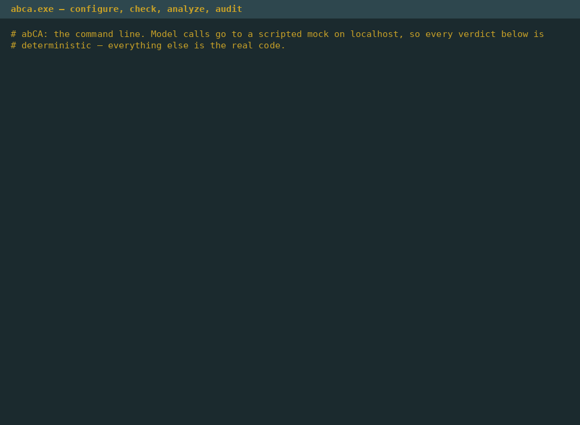
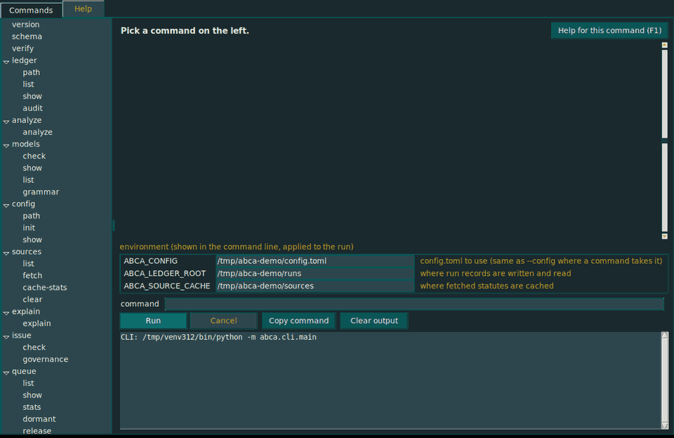
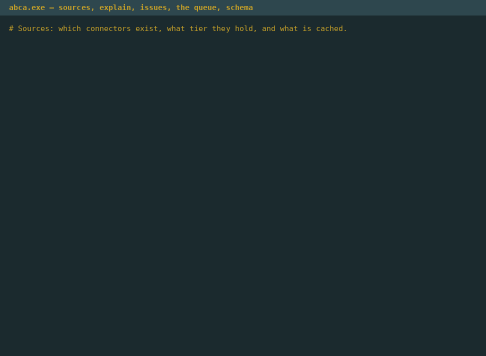
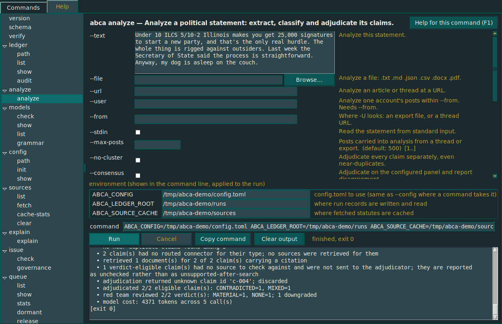
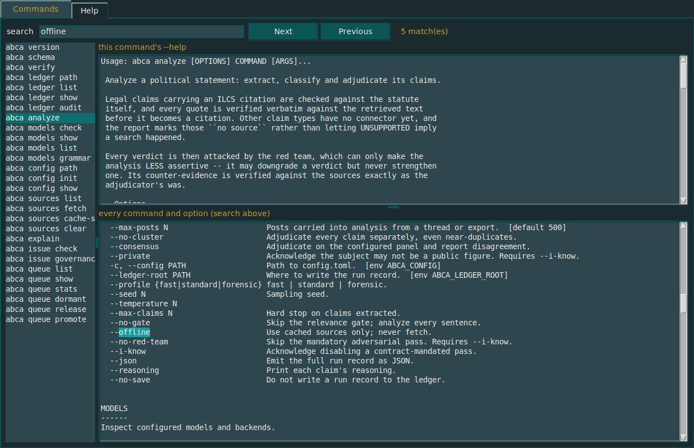

# abCA — agent-based Claim Analyzer

`Works with local & frontier models`
`[Model roles: classifier | adjudicator | backtranslate | embedder]`

`abCA takes a political statement, claim, argument or belief. When it arrives with a source, it runs Path A: fetch the source, adjudicate each claim against it, and publish the verdict with a run hash. When no source is attached, Path B runs instead: dissect the claim, locate a candidate source, and—if one is found—route back through Path A.`

[](#running-the-tests)
[](#running-the-tests)
[](#installation)
[](#platforms)

abCA is a CLI and desktop app that takes a political statement (text, file,
URL, or an account's posting history) and returns a structured, reproducible,
cited analysis of the *claims* inside it. It has no politics. It ships with
zero political positions in its prompts, and every run emits a content-addressed
ledger that a third party can re-execute.

---

## Does it actually work?

Reasonable question to ask of a repo whose entire pitch is "don't take claims on
faith." Everything the badges above assert is checked by one script, which is in
the repo and runs on a clean clone with no GPU, no API key and no model files.
Only the second line below needs a network connection, and only because it
deliberately reaches real government servers:

```bash
./scripts/verify_all.sh
```

Output, verbatim:

```text
=== suite / network / lint / coverage ===
1283 passed, 5 skipped, 9 deselected in 23.0s
9 passed, 1288 deselected in 6.39s
All checks passed!
TOTAL                                  8795   1413    84%

=== identity, corpus and eval-set self-checks ===
  marks match their generator : OK
  brand guide contrast claims : OK
  institutional corpus        : OK
  symmetry pairs (structural) : OK
  symmetry, lanes actually run: OK
  levelset corpus symmetry    : OK
  README contents list current: OK

=== all demos ===
  demo_step1: OK
  demo_step2: OK
  demo_step3: OK
  demo_step4: OK
  demo_step5: OK
  demo_step6: OK
  demo_step7: OK
  demo_step9: OK
  demo_step10: OK
  demo_step11: OK

=== every command in the CLI ===
  version    help exit 0
  schema     help exit 0
  verify     help exit 0
  ledger     help exit 0
  analyze    help exit 0
  models     help exit 0
  config     help exit 0
  sources    help exit 0
  explain    help exit 0
  issue      help exit 0
  queue      help exit 0
```

Reading that top to bottom:

| Line | What it means |
| --- | --- |
| `1283 passed, 5 skipped, 9 deselected` | The unit and integration suite. The 9 deselected are the network tests, which are opt-in by design — a unit suite that hits a state legislature's web server is slow, flaky and rude. Of the 5 skipped, 3 need a Tk display and run on Windows in CI, which is the release's platform; 2 need `reportlab` to build a fixture PDF. |
| `9 passed, 1288 deselected` | Those network tests, run deliberately with `-m network`. They fetch real statute text from ilga.gov, real regulation text from the eCFR API, and a real rule from the Federal Register. They pass, so the connectors work against the live services and not just against fixtures. |
| `All checks passed!` | `ruff check src tests scripts` — lint clean repo-wide, against an explicit rule list rather than ruff's shifting defaults. |
| `TOTAL 8795 1413 84%` | Line coverage over `src/abca`, **measured on Linux with no display** — so `src/abca/gui/app.py`, the window itself, counts as uncovered here; the pipeline underneath it is at the 89% it was before the GUI existed, and the window is exercised by the Tk tests on the Windows runner. The number is not inflated by omitting the file, because omitting a file to raise a number is the thing this repository exists to object to. **`tools/levelset.py` is not in that number** — it sits outside the package on purpose; measured separately it is at 91%. |
| `marks match their generator` | Every one of the 13 logo files is regenerated from the single mongoose outline and compared byte-for-byte. A mark edited by hand fails here — that is how a project ends up with nine slightly different mascots. |
| `brand guide contrast claims` | Every contrast ratio printed in the style guide is recomputed from the hex values. The guide is not allowed to assert its own accessibility without measuring it. |
| `institutional corpus` | Every mechanism fact in `corpus/institutional/` is re-linted offline: no conclusions, quote length, hash integrity, staleness. The `--live` half re-fetches every citation and runs weekly. |
| `symmetry pairs (structural)` | The 46 matched claim pairs are checked for being genuinely matched — opposite valence, same mechanism, comparable length — and for being numerous enough that the exact test can reach significance at all. |
| `symmetry, lanes actually run` | Both lanes are executed on both sides of every pair and five measures are compared with McNemar's exact test. Fails on measured asymmetry **and** on an underpowered sample. See [the symmetry gate](#the-symmetry-gate). |
| `README contents list current` | The numbered contents list is generated by `scripts/build_readme_toc.py`, not maintained by hand; this confirms the generated form matches the file. `tests/test_readme.py` then checks every link resolves. |
| `levelset corpus symmetry` | The same treatment for the comprehension-gap instrument: 48 matched pairs, nine measures. A gap report that leans one way would do more damage than no report, so this is a gate on publication, not a follow-up. See [levelset](#levelset--measuring-what-is-misunderstood). |
| `demo_step1..11: OK` | Ten end-to-end demos, one per build step, each running the full pipeline against the mock model server in `scripts/mock_ollama.py`. These are the honest integration test: real HTTP, real grammar enforcement, real contract gates, real ledger writes. |
| `help exit 0` × 11 | Every command group in the CLI loads and responds. A broken import in a rarely-used subcommand exits non-zero here. |

Two caveats stated plainly, because a verification section that overstates
itself is worse than none:

- **The demos use a mock model server, not a real one.** They prove the
  *machinery* is correct — grammar, contracts, gates, hashing, replay — not that
  any particular model produces good verdicts. Model quality is a separate
  question, and the ledger exists precisely so it can be argued about with
  evidence.
- **This README checks itself.** `tests/test_readme.py` asserts that every
  numbered contents link resolves to a real heading, that every heading appears
  in the contents, that the numbering matches the heading depth, that the
  contents are in document order, that every relative link points at a file that
  exists, and that the test count in the badge matches the one in the output
  above. A document whose entire subject is verification does not get to make
  unverified claims about itself. It found two real defects the first time it
  ran: a duplicate anchor, and a contents link that resolved locally and would
  have 404'd on GitHub.

- **The model half of the levelset gate is not in this sweep**, because it
  needs a real model and this script promises to run with none. It is not
  deferred, though: CI's `model` job provisions its own — Ollama on a plain
  runner, small open-weight models, weights cached — and runs it on a schedule. See [A runner that has a model](#a-runner-that-has-a-model).

If any line above prints `FAILED` on your clone, this README is wrong and should
be treated as wrong.

---

## Contents

1. [Does it actually work?](#does-it-actually-work)
2. [Why the separation is non-negotiable](#why-the-separation-is-non-negotiable)
3. [What the Analyzer will and won't do](#what-the-analyzer-will-and-wont-do)
4. [Identity](#identity)
5. [Installation](#installation)
6. [Watch it run](#watch-it-run)
7. [The desktop front end](#the-desktop-front-end)
8. [The Windows release](#the-windows-release)
9. [Quick start](#quick-start)
10. [Configuration](#configuration)
   - **10.1** [API keys: OpenAI and Claude](#api-keys-openai-and-claude)
   - **10.2** [Model roles](#model-roles)
11. [Backends](#backends)
   - **11.1** [Reproducibility and weight pinning](#reproducibility-and-weight-pinning)
   - **11.2** [Running on EC2](#running-on-ec2)
12. [Plain language, proven](#plain-language-proven)
   - **12.1** [The three passes](#the-three-passes)
   - **12.2** [What the diff checks](#what-the-diff-checks)
   - **12.3** [When it fails](#when-it-fails)
13. [Inputs](#inputs)
   - **13.1** [Files](#files)
   - **13.2** [URLs](#urls)
   - **13.3** [One account's posts](#one-accounts-posts)
   - **13.4** [Authors are pseudonymized](#authors-are-pseudonymized)
14. [Clustering](#clustering)
15. [Consensus](#consensus)
16. [Issues and solutions](#issues-and-solutions)
   - **16.1** [--ref is required, and the command refuses without it](#--ref-is-required-and-the-command-refuses-without-it)
   - **16.2** [A declared kind is a ceiling, never a promotion](#a-declared-kind-is-a-ceiling-never-a-promotion)
   - **16.3** [Who is allowed to decide](#who-is-allowed-to-decide)
   - **16.4** [Ranking is arithmetic, not judgment](#ranking-is-arithmetic-not-judgment)
   - **16.5** [Exit codes for abca issue](#exit-codes-for-abca-issue)
17. [What's next: sourceless claims](#whats-next-sourceless-claims)
   - **17.1** [Two lanes](#two-lanes)
   - **17.2** [Three rules that make it safe](#three-rules-that-make-it-safe)
   - **17.3** [Why promotion matters](#why-promotion-matters)
   - **17.4** [The promotion gate](#the-promotion-gate)
18. [The symmetry gate](#the-symmetry-gate)
   - **18.1** [Matched pairs](#matched-pairs)
   - **18.2** [Five measures](#five-measures)
   - **18.3** [The statistics, and why they are exact](#the-statistics-and-why-they-are-exact)
   - **18.4** [Three verdicts, not two](#three-verdicts-not-two)
   - **18.5** [What it prints](#what-it-prints)
19. [levelset — measuring what is misunderstood](#levelset--measuring-what-is-misunderstood)
   - **19.1** [The corpus is the unit, not the post](#the-corpus-is-the-unit-not-the-post)
   - **19.2** [Five lints, enforced in code](#five-lints-enforced-in-code)
   - **19.3** [Consensus demotes; it never drops](#consensus-demotes-it-never-drops)
   - **19.4** [Isolated from the pipeline, and held there](#isolated-from-the-pipeline-and-held-there)
   - **19.5** [It is gated, and the tool says so itself](#it-is-gated-and-the-tool-says-so-itself)
   - **19.6** [The model half, actually measured](#the-model-half-actually-measured)
20. [A runner that has a model](#a-runner-that-has-a-model)
   - **20.1** [What building it found](#what-building-it-found)
   - **20.2** [What the first green install found](#what-the-first-green-install-found)
21. [The pipeline](#the-pipeline)
   - **21.1** [Stage order](#stage-order)
   - **21.2** [How each stage fails](#how-each-stage-fails)
   - **21.3** [Claim spans](#claim-spans)
22. [Sources and evidence](#sources-and-evidence)
   - **22.1** [A model cannot produce a citation](#a-model-cannot-produce-a-citation)
   - **22.2** [Connector coverage](#connector-coverage)
   - **22.3** [What UNSUPPORTED means](#what-unsupported-means)
23. [The red team](#the-red-team)
   - **23.1** [It can only weaken](#it-can-only-weaken)
   - **23.2** [Severity](#severity)
   - **23.3** [Independence](#independence)
24. [How output is enforced](#how-output-is-enforced)
   - **24.1** [The two layers](#the-two-layers)
   - **24.2** [Contract gates](#contract-gates)
25. [The run ledger](#the-run-ledger)
   - **25.1** [Tamper evidence](#tamper-evidence)
   - **25.2** [Verification outcomes](#verification-outcomes)
26. [Command reference](#command-reference)
27. [Exit codes](#exit-codes)
28. [Documents](#documents)
29. [Build status](#build-status)
30. [Platforms](#platforms)
31. [Repository layout](#repository-layout)
32. [Running the tests](#running-the-tests)

---

## Why the separation is non-negotiable

A fact-checker is only worth anything to someone who disagrees with whoever is
running it. "Our own fact-checker confirms we are correct" is structurally
identical to the thing a fact-checker claims to oppose. It is the failure mode,
not an edge case. So the tool is built so that it *cannot* be quietly tuned by
its operator:

- **The Analyzer's prompts contain no political positions.** Not softened, not
  implied. A reviewer can diff `src/abca/prompts/` and confirm it, and
  `assert_doctrine_free()` runs as a test.
- **`identity/`, `corpus/` and `evals/` are data, never imported by `src/`.**
  Enforced by import-lint tests. If the Analyzer cannot import an opinion — or
  its own mascot and color — it cannot be steered by one. A second test asserts
  the prompts never say "mongoose" either.
- **Matched pairs are checked in aggregate.** A system that treats one side of
  a matched claim pair more sceptically than the other fails silently — every
  verdict looks defensible on its own — so the symmetry gate runs on every
  commit and fails on measured asymmetry *and* on an underpowered sample.
- **Verdicts are reproducible.** Every run emits a content-addressed ledger —
  input hash, model weights hash, seed, prompt version, retrieval snapshot.
  `abca verify <run-id>` re-executes and diffs.

A fact engine is only credible if it can be turned on its owner and the owner
has pre-committed to publishing what comes back. This one can be, and this
repository's own CI does exactly that to its own brand guide, corpus and eval
sets on every push.

## What the Analyzer will and won't do

**Will:**

- Split an input into atomic claims and classify each one (legal / empirical /
  predictive / normative / definitional / attributive).
- Resolve legal and empirical claims against primary sources — statute, CFR,
  court opinions, agency data.
- Translate legal text to ~8th-grade reading level and then *prove* the
  translation preserved meaning, via a back-translation diff gate.
- Report the strongest counter-evidence to its own conclusion, every time.
- Report cross-model disagreement as a finding rather than averaging it away.

**Won't:**

- **Score a human being.** It analyzes claims, never rates people. A per-person
  "truth score" is a harassment instrument and there will not be one.
- **Render verdicts on normative claims.** "This tax is unfair" is a value
  judgment. The tool surfaces the factual premises underneath it and checks
  *those*, then says plainly that the value question is not one evidence settles.
- **Attribute content to a specific foreign state.** It can say "this matches a
  narrative pattern documented in [ODNI report / DOJ indictment]." It cannot say
  "this is a Russian bot," because open-source data does not support attribution
  and pretending otherwise is the exact epistemic vice this project opposes.
- **Say TRUE or FALSE.** The verdict vocabulary is deliberately narrower and more
  honest than that.

---

## Identity


The mark is a mongoose: an animal known for taking on dangerous things by
being quick and careful rather than big, and for being *resistant* to venom,
not immune — which is the honest word for what a claim checker is. Every file
in `identity/logo/` is generated from one outline by
`scripts/build_identity.py`, and every contrast ratio in the brand guide is
recomputed from the hex values by `scripts/check_contrast.py`. Both run in CI.
The full guide — name, marks, palette, type, voice — is in
[`identity/README.md`](identity/README.md).

```bash
python scripts/build_identity.py --check   # marks match their generator
python scripts/check_contrast.py           # the guide's contrast claims are true
```

`src/` never reads `identity/`, and the prompts never mention the mascot; a
test enforces both.

---

## Installation

Python 3.11 or newer. No compiled dependencies.

```bash
git clone https://github.com/pjcampbe11/abCA.git
cd abCA
pip install -e ".[dev]"
abca version
abca-gui        # the desktop front end; see below
```

**No Python?** Download the Windows release — `abca.exe` and `abca-gui.exe` in one
folder, nothing to install. See [The Windows release](#the-windows-release).

Runtime dependencies are deliberately minimal — `pydantic`, `typer`, `rich`.
HTTP is stdlib. Every library version is recorded in each run record and
reported on verification mismatch, so each dependency is one more thing that can
differ between the machine that produced a verdict and the machine checking it.

## Watch it run

Four recordings, split the way the release is split. Every command in them ran for
real — the actual CLI, the actual window, real HTTP, real ledger writes, real hash
chains. The one thing mocked is the model: `scripts/mock_ollama.py` answers on a
loopback port with scripted verdicts, exactly as the test suite uses it, which is the
only reason a full analysis fits in a GIF. Nothing is hand-drawn; `python
scripts/record_demos.py` regenerates all four from scratch, so a demo can never show a
command that no longer exists.

**`abca.exe` — configure, check the backend, analyze, audit the record**

<p align="center"></p>

**`abca-gui.exe` — the same analysis from the window, then help and search**

<p align="center"></p>

**`abca.exe` — everything else: sources, explain, issues, the queue, the schema**

<p align="center"></p>

**`abca-gui.exe` — everything else: ledger, verify, sources, the queue, environment, F1**

<p align="center"></p>

## The desktop front end

```bash
abca-gui                  # or: python -m abca.gui
```

<p align="center">
  
</p>

Every command the CLI has, as a form. Dark by default, in the abCA palette.
Three rules make it more than a convenience:

**It is generated from the CLI, never copied from it.** Every form is built at
start-up by walking the Typer command tree ([`src/abca/gui/surface.py`](src/abca/gui/surface.py)).
There is no hand-written list of options anywhere. That is the only way the promise
"the GUI does everything the CLI does" can be *tested*: `tests/test_gui.py` walks the
same tree independently and asserts every one of the 29 commands and 106 parameters
has a control. Add an option to the CLI and it appears in the window without anyone
remembering to.

**It never re-implements a command.** The window builds the exact argv you would have
typed ([`src/abca/gui/argv.py`](src/abca/gui/argv.py)), shows it above the Run button —
copy-paste-able, quoted for your shell — and runs the real CLI as a subprocess. So a run
started from the window writes the same ledger record, with the same hashes, as the
same command typed by hand. Nothing the GUI does is unreproducible from a terminal.
A test feeds every built argv back to click and asserts it parses to the form's values.

**It is standard library only.** `tkinter`, for the same reason the CLI has three
dependencies. The dark theme mirrors the brand tokens by value — `src/` is forbidden
from reading the identity directory, and a test holds the two in agreement and measures
every text pair against WCAG AA with the same contrast function the brand guide is held
to.

<p align="center">
  
</p>

**Help you can navigate.** F1 on any form, or the button beside its title, opens the
Help tab at that command: an index of every command on the left, the command's full
`--help` on top, and a searchable reference of every command and option below with
matches highlighted. All in the tab — a help window that opens other windows is not
easy to navigate.

## The Windows release

```powershell
pip install -e ".[release]"
python scripts/build_release.py
# -> dist/abca-<version>-windows-amd64.zip
```

One folder, two executables:

| | |
|---|---|
| `abca.exe` | the command line — `abca --help` |
| `abca-gui.exe` | the desktop front end, windowed, dark, F1 for help |

They ship together because the GUI runs the CLI *beside it* — `abca-gui.exe` looks for
`abca.exe` in its own folder, which is why [`abca.spec`](abca.spec) emits one `COLLECT`
folder rather than two one-file binaries that would each unpack to a different temp
directory and never meet. The prompts travel in the bundle, byte-identical to the
wheel's, because every run record hashes the prompt it used and a binary shipping
different bytes would produce hashes no other verifier could reproduce.

**A built release is not a working release.** After PyInstaller runs,
[`scripts/build_release.py`](scripts/build_release.py) executes the *frozen* binaries:
`version --json`, `schema`, every command group's `--help` (where a missing hidden
import surfaces, because typer imports the module to render it), a grammar (package
data travelled), and the frozen GUI constructing its whole window and running a command
through the frozen CLI beside it. The zip is written only if all of that passes, so a
broken build cannot be uploaded by accident.

CI's `release` job does this on `windows-latest` on **every push** — a release build
that only runs at release time is broken at release time — and uploads the zip as a
build artifact. Pushing a tag `v*` additionally attaches it to a GitHub Release:

```bash
git tag v0.1.0 && git push origin v0.1.0
```

The frozen GUI's own self-check, `abca-gui.exe --abca-self-check`, is what the job runs
against the real display a Windows runner has; it is the same check you can run on a
download.

## Quick start

```bash
# 1. Write a documented starter configuration
abca config init

# 2. Point it at your models, then confirm every backend is reachable
abca models check

# 3. See exactly what will run, and whether anyone can verify it
abca models show adjudicator

# 4. Analyze a statement, a file, or a thread
abca analyze -t "Under 10 ILCS 5/10-2 Illinois makes you get 25,000 signatures
to start a new party, and that's the only real hurdle."
abca analyze -f thread.json          # an export: .txt .md .json .csv .docx .pdf
abca analyze -u https://example.com/article
abca analyze -U @someone --from thread.json

# 5. Read a statute in plain English — and see the proof it still says the same thing
abca explain --cite "10 ILCS 5/10-2"

# 6. Inspect, audit, and replay the record it wrote
abca ledger show <run-id> --stages
abca ledger audit
abca verify <run-id>

# No model installed? Every demo runs against a test double.
python scripts/demo_step1.py --ledger-root .abca/runs   # ledger + tamper evidence
python scripts/demo_step2.py                            # structured-output repair
python scripts/demo_step3.py                            # real CLI, real HTTP, end to end
python scripts/demo_step6.py                            # the fidelity gate, every failure mode
python scripts/demo_step7.py                            # files, URLs, threads, clustering
```

Output on that statement — both citations are real, verified text from the
actual statute:

```
id     type  verdict        conf  src  claim
c-001  LEG   MIXED          0.88  T0   Under 10 ILCS 5/10-2 Illinois requires 25,000 signatures...
c-002  LEG   CONTRADICTED   0.86  T0   ...the signature count is the only real obstacle...
c-003  NRM   UNVERIFIABLE   0.91   -   The ballot-access system is rigged against outsiders.
c-004  ATT   no source      0.00   -   The Secretary of State said the process is straightforward.

citations (every quote verified verbatim against the retrieved source)
  c-001 [T0] 10 ILCS 5/10-2 — https://www.ilga.gov/.../001000050K10-2.htm
      "signed by 1% of the number of voters who voted at the next preceding
       Statewide general election or 25,000 qualified voters, whichever is less"
```

> **Connector coverage is three sources** — Illinois statutes, the CFR via
> eCFR, and the Federal Register via GPO, all T0 and all by citation. A claim no
> connector can serve is marked `no source`, never `UNSUPPORTED`, and the
> coverage note is the first entry in every run record. See
> [What UNSUPPORTED means](#what-unsupported-means).

---

## Configuration

`abca config init` writes a commented `config.toml` to the platform location
(`%APPDATA%\abca\` on Windows, `$XDG_CONFIG_HOME/abca/` on POSIX). Override with
`--config PATH` or `$ABCA_CONFIG`.

```toml
[defaults]
profile       = "standard"   # fast | standard | forensic
seed          = 42
temperature   = 0.0
max_claims    = 200
reading_level = 8
max_attempts  = 3

[models.classifier]
provider = "ollama"
model    = "qwen2.5:7b-instruct"

[models.adjudicator]
provider = "ollama"
model    = "qwen2.5:32b-instruct"

[models.backtranslate]
provider = "ollama"
model    = "llama3.1:8b-instruct"

[models.embedder]
provider = "ollama"
model    = "nomic-embed-text"
```

### API keys: OpenAI and Claude

Three ways to supply a key, in resolution order:

| # | Method | Example |
|---|---|---|
| 1 | Inline in config | `api_key = "sk-..."` |
| 2 | Environment variable | `api_key_env = "OPENAI_API_KEY"` |
| 3 | Nothing | valid for a local OpenAI-compatible server |

The environment variable is the recommended path. `api_key_env` defaults per
provider — `OPENAI_API_KEY` for OpenAI, `ANTHROPIC_API_KEY` for Claude — so you
usually don't set it at all.

```toml
# OpenAI
[models.adjudicator]
provider    = "openai"
model       = "gpt-4o"
api_key_env = "OPENAI_API_KEY"     # optional; this is the default

# Claude
[models.adjudicator]
provider    = "anthropic"          # "claude" also works
model       = "claude-sonnet-4-5"
api_key_env = "ANTHROPIC_API_KEY"  # optional; this is the default

# Any OpenAI-compatible endpoint — Azure, OpenRouter, Together, local vLLM
[models.consensus]
provider    = "openai-compatible"
model       = "meta-llama/Llama-3.3-70B-Instruct"
base_url    = "https://openrouter.ai/api/v1"
api_key_env = "OPENROUTER_API_KEY"
vendor      = "openrouter"
```

Or set it in code:

```python
from abca.providers.anthropic import AnthropicProvider
from abca.providers.openai_compat import OpenAICompatibleProvider

claude = AnthropicProvider("claude-sonnet-4-5", api_key="sk-ant-...")
gpt    = OpenAICompatibleProvider("gpt-4o", api_key="sk-...")
```

**Keys are never written to a run record, never logged, and are redacted in
`repr()`.** Run records are meant to be published; a credential in one would be
published with it. An inline key in the config produces a warning, because the
file then *is* a secret — `.gitignore` covers it, but don't tempt fate.

Claude has no embeddings endpoint. Pair it with a local embedder:

```toml
[models.embedder]
provider = "ollama"
model    = "nomic-embed-text"
```

### Model roles

Roles exist so cheap work runs cheap.

| Role | Runs | Should be |
|---|---|---|
| `classifier` | gate + classify, once per sentence and per claim | small (7–8B) |
| `segmenter` | decomposes sentences into claims (falls back to `classifier`) | small, or larger for dense legal text |
| `adjudicator` | on claims that survive gating | large |
| `redteam` | attacks every verdict (falls back to `adjudicator`) | **different from `adjudicator`** |
| `backtranslate` | on plain-language rewrites of legal text | **different from `adjudicator`** |
| `embedder` | once per claim, for clustering | an embedding model |
| `consensus` | N models on the same claim, in `forensic` | a list |

Putting the 27B in the `classifier` slot is the single easiest way to make the
`fast` profile useless.

`backtranslate` **must** differ from `adjudicator`. A model that grades its own
plain-language rewrite reproduces its own misreadings, and the fidelity gate
silently becomes a no-op. This is enforced in three places — config load,
registry build, and record validation — because the failure it prevents produces
no error and no visible symptom of its own. The registry check compares
*resolved weights hashes*, not config strings, so two names pointing at one model
are caught too.

---

## Backends

| Backend | Pinning | Constrained decoding | Reproducible |
|---|---|---|---|
| `llamacpp` | SHA-256 of the GGUF file | GBNF grammar | ✅ |
| `ollama` | manifest digest via `/api/tags` | JSON Schema as `format` | ✅ |
| `anthropic` | none (hosted) | forced tool-use with `input_schema` | ❌ |
| `openai` | none (hosted) | `strict` json_schema mode | ❌ |

### Reproducibility and weight pinning

A run is marked `reproducible: true` **if and only if** every model in it
returned a real weights hash. No config flag can assert it — the value is
derived from the live backend on every run.

- **Ollama** reports a manifest digest that commits to the weight blobs, the
  quantization, the template, and the default parameters. `qwen2.5:32b-q4_K_M`
  and `-q5_K_M` have different digests, which is correct — they produce
  different output. If the digest can't be obtained, the provider raises rather
  than returning `None`; silently degrading would flip a run's reproducibility
  without anyone noticing.
- **llama.cpp** hashes the GGUF itself, memoized on `(path, size, mtime)`.
  Hashing 18 GB on every run would be absurd; skipping it would make the pin a
  lie. The cache is a convenience over an expensive pure function — there is no
  path that reports a hash it did not compute from the bytes.
- **Hosted APIs** return `None`, and verification returns `UNREPLAYABLE` even
  when the replay output is byte-identical, because agreement by coincidence is
  not verification.

Use hosted models for exploration and for a dissenting voice in consensus mode.
Use local open-weight models for anything you intend to publish.

### Running on EC2

The setup in [`docs/04-linux-ec2.md`](docs/04-linux-ec2.md) forwards a g6
instance's Ollama to `localhost:11434` over SSH:

```bash
ssh -i ~/.ssh/abca-g6.pem -N -L 11434:127.0.0.1:11434 ubuntu@<instance-ip>
```

Nothing in the code knows or cares — the tunnel makes a remote model look local,
**and the manifest digest comes back over it intact**. So weight pinning works
identically for a model on your laptop and a 27B on a g6.xlarge, which is what
makes the cheap topology viable. No config change needed.

---

## Plain language, proven

Contract §5 promises legal text an eighth-grader can read, with the meaning
intact. The second half is the hard one, and it fails quietly:

> A rewrite that drops an exception reads **better** than one that keeps it.

Fluency and fidelity pull in opposite directions and only fluency is visible.
A plain-language rendering of a statute is also the most quotable thing this
tool produces — somebody will screenshot it — so a rewrite that lost an
"unless" is wrong in a way no reader can detect by looking at it.

So the rewrite is not trusted. It is tested.

### The three passes

```
source provision
      |
      v
[A] extract         (renderer model)   -> operative elements, in the statute's words
      |
      v
[B] render          (renderer model)   -> the plain-language version
      |
      v
[C] back-translate  (DIFFERENT model)  -> reconstructs the rule from the rewrite
      |                                   ALONE. It never sees the statute.
      v
   deterministic diff, in code
      |
      +-- clean -----> ship the rendering
      +-- anything ---> regenerate [B]; after 3 failures ship the
                        STATUTE VERBATIM, marked unresolved
```

Two isolations, and losing either makes the gate a no-op that reports success:

**A different model.** One that grades its own simplification reproduces its
own misreadings — if it read "shall" as "may" in pass B, it reads the "may" in
its own rewrite as faithful in pass C. Enforced in three places (config load,
run record, run time), compared by resolved **weights hash** rather than name,
because two config entries can point at one model under different tags.
`backtranslate` is the only role in the system with no fallback.

**No source access.** `build_backtranslate_prompt(prompt_text, rendering)` has
no parameter the statute could arrive through. Not "the model is told to ignore
it" — there is nothing to ignore. An instruction can be diluted by a later edit
and nothing would fail; a missing parameter cannot be passed by accident.

### What the diff checks

The comparison is **code, not a fourth model call**. The score goes into a
published run record and drives regeneration, so a model deciding "close
enough" would make it irreproducible and would put the thing being audited
inside the auditor.

| Signal | Comparison | Why |
|---|---|---|
| Element kind | exact | A REQUIREMENT returning as a CONDITION is the rewrite changing what the provision *does* |
| Modal force | exact | `shall` ≠ `may` ≠ `must not` ≠ `need not` — the highest-signal check available, and fully mechanical |
| Numeric anchors | all must survive | Numbers, percentages and dates are where meaning most often changes under simplification |
| Token overlap | ≥ 0.35 | The weakest signal on purpose: all it must do is stop two *unrelated* elements from pairing up |

The modal and the anchors are read **from the element's text**, never reported
by the model — one that could declare its own modal could declare the one it
happened to preserve. Overlap is measured on conservatively stemmed tokens,
because a plain-language rewrite uses different words and that is the entire
point of the exercise.

A rewrite passes only if **nothing was dropped and nothing was added**. An
invented obligation fails as hard as a lost one, and it scores 1.00 on
preservation — which is exactly why the added-element check exists.

```
$ abca explain --cite "10 ILCS 5/10-2"

FIDELITY GATE PASSED
elements in statute         3
recovered from the rewrite  3  (by an independent model that never saw the statute)
fidelity score              1.00
modal force preserved       yes
rewrites attempted          1
reading grade               grade 7.9 (within the 7-9 target)

plain language

A group of people who want to start a new political party across the whole
state must file a petition. The petition must be signed by 1% of the voters
who voted in the last statewide general election, or by 25,000 qualified
voters, whichever is less. The petition must also list the party's candidates.
It must name a candidate for every office to be filled. That list must be
there on the day the petition is filed.
```

The gate's numbers print **before** the rendering, always. The tool would look
more polished printing just the paragraph. It would also be the thing the
contract exists to prevent.

### When it fails

Three failed rewrites emit the statute's own words with `unresolved=true`, and
the command exits 10:

```
FIDELITY GATE FAILED — showing the statute's own words
fidelity score              0.67
modal force preserved       NO — an obligation changed strength

what the check found
  attempt 1 (score 0.67)
    • MODAL CHANGE (MANDATORY -> PERMISSIVE): shall file a petition signed by 1%...
```

That outcome is **acceptable and required to be reachable**, not an error. An
unverified rewrite of a law is worse than a hard-to-read law, so every
threshold in the gate is set strict: a false FAIL costs readability, a false
PASS ships a rendering that changed the law while claiming to preserve it.

Readability is a **flag**, never a hard failure — forcing a grade band by
cutting clauses is precisely how a rewrite loses an exception. The scope and
locked-glossary linters advise the same way. Fidelity outranks readability
whenever the two conflict, and which of them can fail a run is how that
ordering is enforced.


## Inputs

Everything becomes a **thread**, and a bare statement is a thread of one post:

```
-t "..."      ──┐
--stdin       ──┤
-f file.txt   ──┼──▶ Thread ──▶ one document + a span per post ──▶ the pipeline
-u https://...──┤
-U @a --from X──┘
```

Not a cute framing — it is why `-t` cannot quietly diverge from `-f`. One code
path, one normalization recipe, one set of limits. Which post a claim came from
is tracked *alongside* the text, never inside it: an `[a-01]` marker written into
the document would be hashed, fed to the segmenter, and eventually extracted as
though the author had written it.

### Files

Dispatch is by **extension, never by sniffing content**. A `.txt` holding a JSON
array stays prose — reparsing it silently would change which words get attributed
to whom, with no sign to the person who named the file.

| Format | How | Dependency |
|---|---|---|
| `.txt` `.md` `.log` `.rst` | decoded as text | none |
| `.json` | conversation export — article, comments, nested replies | none |
| `.csv` `.tsv` | conversation export, dialect sniffed | none |
| `.docx` | `zipfile` + `ElementTree`, whole-tree walk | none |
| `.pdf` | `pip install 'abca[pdf]'` | optional extra |

Decoding is **strict**, and the codec used is reported. Nothing on an input file
is ever decoded with `errors="replace"`: replacement characters would be
segmented, quoted and hashed as though somebody wrote them. UTF-16 is tried only
behind a byte-order mark, because `b"caf\xe9"` decodes as UTF-16 without error
and returns two unrelated CJK characters.

A PDF without the extra is **refused with the install command**, not half-read —
a stub extractor returning partial text produces an analysis reporting that a
document makes no claims, which is not the same finding as looking and finding
none. Scanned PDFs with no text layer are refused for the same reason, and every
PDF run carries a note that extraction is approximate and spans index the
extracted text rather than the page.

### URLs

Two strategies, in order: **schema.org JSON-LD** (article body and comments, with
authors the publisher named explicitly), then **the whole page as one post, with a
note saying so**.

There is deliberately no third strategy that hunts for comment containers by
class name. Heuristic scraping mis-attributes — a moderator's boilerplate ends up
in someone's mouth, or one comment becomes three — and for a tool whose value is
that claims trace to what somebody actually wrote, "roughly the right comments"
is not a usable standard.

A fetched page is the **object under analysis and never evidence**. That is
structural: evidence enters through a connector that declares its own tier, and a
fetched page enters as the analyzed document. There is no sequence of events in
which an article's own assertion becomes a citation supporting itself.

### One account's posts

`-U @someone --from thread.json` filters posts you **already have**. It does not
go and fetch an account's history, because the only way to do that is scraping —
brittle, generally against the platform's terms, and it would make this a
surveillance tool the moment it worked.

Handle matching is literal. An unknown handle is an error, not an empty analysis:
empty output would read as "this account made no claims."

Every `-U` run carries this as the first note in its record, not just in the
terminal:

> **CLAIMS, NOT A PERSON.** Each claim stands or falls on its own evidence. There
> is no aggregate score for the account, no ratio, and no characterization of the
> person: contract §8 refuses those, because a per-person truth score is a
> harassment instrument whatever it is called.

### Authors are pseudonymized

Contract §8 refuses to characterize a person. A run record is meant to be
published. Together those force one conclusion: **a published record must not
carry the handles of the people whose comments were analyzed.**

Handles become `a-01`, `a-02` in first-appearance order, and the record stores
counts only. The real handles stay in memory, where the local report uses them —
the same rule the input text follows, where the record keeps the hash and the
local store keeps the text. A test serializes a whole record and asserts no
handle appears anywhere in it.

Positional stand-ins rather than hashed handles, deliberately: a hash of a handle
is reversible by anyone with a list of handles to try, which for a public
platform is everyone.

---

## Clustering

Forty people in a thread assert the same thing about the same statute. One at a
time that is forty retrievals, forty adjudications and forty red-team calls to
reach one answer forty times.

The danger is larger than the problem:

> Clustering means **one claim's verdict is published against another claim's
> words.**

So four things must match **exactly** before prose similarity is measured at all
— claim type, stance ambiguity, the numeric anchors in the text, and the statute
sections cited:

```
MERGE     reworded, same claim          overlap=0.90  prose overlap cleared the bar
SEPARATE  different number (20,000)     overlap=1.00  an exact gate differs
SEPARATE  different section (5/10-3)    overlap=0.90  an exact gate differs
SEPARATE  different claim, same statute overlap=0.35  an exact gate differs
```

Look at the second row. **25,000 and 20,000 have identical prose overlap**,
because a stemmed token comparison cannot see the difference between two numbers.
Similarity alone would have merged them. The anchor gate runs first for exactly
that reason.

The overlap threshold is `0.75` — far stricter than the fidelity gate's `0.35`,
using the same tokenizer. Opposite problems: there, a rewrite is *supposed* to use
different words; here, different words are evidence of a different claim.

The grouping is **published**, not trusted. Every clustered claim carries its
group's size and the group's true lowest pairwise similarity, and every member
says plainly what happened:

```
[This claim was NOT adjudicated on its own text. It was grouped with 3
near-identical claims and carries the verdict reached for c-001, which reads:
"Under 10 ILCS 5/10-2 Illinois requires 25,000 signatures to form a new party."
The grouping's weakest pairwise similarity is 0.86 and is published so it can be
checked. Re-run with --no-cluster to adjudicate every claim separately.]
```

A member inherits the representative's adjudication, red-team finding **and**
downgrade — all three. Taking the verdict without the objections raised against
it would publish the confident half of an analysis and drop the honest half.

`--no-cluster` is always safe and always slower.


## Consensus

`--consensus` runs the adjudication on a panel of models and reports where they
disagree. What it must never do is **average**.

Publishing the majority verdict produces a number that looks more trustworthy
than any single model's and is, in the case that matters, less so: when two
models say `SUPPORTED` and one says `CONTRADICTED`, the majority answer hides
the single most useful fact the run produced. A claim that splits a panel is not
67% true. It is a claim the sources did not settle for every reader of them.

So the panel publishes **the weakest verdict any member reached**, and the split
ships as a number on the claim:

```
id     type  verdict   conf  src  ×  split  claim
c-001  LEG   MIXED     0.60  T0   ·  0.50   Illinois requires 25,000 signatures…

consensus panel (qwen2.5:32b, llama3.1:70b; 1 of 1 claim(s) split)
  c-001 split 0.50 → published MIXED
    qwen2.5:32b  SUPPORTED (0.90)
    llama3.1:70b MIXED     (0.60)
```

Same reasoning as the red team's one-way ratchet: a mechanism with the power to
change verdicts is trustworthy in proportion to how narrow that power is. The
worst a disagreeing panel can do here is make the tool say *less* than one
member knew — a failure, but a safe one.

**The case the strength table cannot settle.** `SUPPORTED` and `CONTRADICTED`
are equally assertive, so "weakest" does not choose between them — they are
opposite, not ordered. A panel holding both resolves to `UNSUPPORTED` at zero
confidence with *both* sides' citations attached and a note saying plainly what
happened. `MIXED` was the alternative and was rejected: MIXED is a claim about
the **evidence** ("substantive support on both sides"), and asserting it because
two models disagreed would put the tool's own confusion into a slot reserved for
a reading of the sources.

Two configuration rules, both enforced at load:

- **At least two models.** A panel of one always agrees with itself.
- **No duplicates**, compared by resolved weights hash rather than by config
  string. At temperature 0.0 the same weights return the same verdict, so a
  duplicated member reports unanimous agreement produced by asking one model
  twice — the most misleading output this mode can produce.

Confidence is the **lowest** any member reported, never the average. Citations
are the **union** across the panel, so a reader sees the passage that persuaded
the dissenter.

---

## Issues and solutions

`abca analyze` asks whether a claim is supported. `abca issue` asks the larger
question: given a situation and the evidence somebody actually brought, what is
established, what is a value call, what is still unknown — and, with `--solve`,
what could be done and **who is allowed to decide it**.

### `--ref` is required, and the command refuses without it

```bash
abca issue check \
  -t "Federal prison wages do not reach the families of the people earning them." \
  --ref 'primary:28 CFR 545.11||Special Assessments imposed under 18 U.S.C. 3013' \
  --ref 'primary:28 CFR 345.51||receive pay at five levels ranging from 5th grade pay' \
  --ref 'social:https://example.com/post/1'
```

Not a warning — a refusal, with exit code 12 and a list of what is missing. The
default floor is three references, at least one primary or official, and at most
half social. `--strict` raises it to the publication floor intended for anything
put out under the tool's name.

The reason is narrow. A model handed *"crime is out of control downtown"* and
nothing else will produce paragraphs of fluent, confident, entirely unsourced
policy analysis. It will read well and cite nothing, and it is indistinguishable
in form from the thing this tool exists to be an alternative to. The only
reliable defense is for that code path not to exist.

### A declared kind is a ceiling, never a promotion

Each reference is typed at the command line:

| Kind | What it is | Tier ceiling |
|---|---|---|
| `primary` | Constitution, statute, regulation, court opinion | T0 |
| `official` | Agency data, filing, docket, on-the-record statement | T1 |
| `research` | Peer-reviewed or method-transparent study | T2 |
| `reporting` | Journalism with a published corrections policy | T3 |
| `social` | A post | T4 — **never evidence** |

The declared kind can only ever *lower* the tier a connector assigns, never
raise it. Typing `primary:` in front of a blog does not make it primary law,
exactly as a model asserting `T0` does not. A social post is admissible as the
**object** of analysis — this is the claim circulating, here is where — and never
as proof the claim is true; that distinction lives in code, not in a prompt
asking a model to remember it.

A reference nobody can fetch is kept in the record at T4 with the reason
attached, rather than dropped. Dropping it would make a thin record look
thorough. A supplied quote that does not appear verbatim in the fetched source
is discarded and the reference is flagged — an unverified quote attached to a
real source borrows that source's authority for words it does not contain.

### Who is allowed to decide

The point of automating any of this is to remove red tape, delay, and
decisions bought by whoever is paying. So every step of a plan carries a
governance tier, and the tier is **derived from the classes of claim the step
rests on** — no model writes it, and no flag moves the line:

```
abca issue governance
```

| Tier | Rests on | Who decides |
|---|---|---|
| `MECHANICAL` | No contestable claim at all | **Fully automated.** Eligibility arithmetic, routing, disbursement, publication |
| `VERIFIABLE` | Legal, empirical or attributive claims | Automated **as a mandatory published check** before the step runs |
| `VALUE` | Any normative, definitional or predictive claim | A **named human**, who must publish the run hash of what was in front of them |

One value claim anywhere in a step makes the whole step `VALUE`, and the
escalation is one-way — the same ratchet the red team uses, for the same reason.
A serialized plan **cannot** carry a step marked automatable that rests on a
value judgment; the schema refuses it.

**Why not automate the vote itself.** Because the value question does not
disappear when you automate it — it moves into whoever wrote the objective
function, where it is harder to see and impossible to vote out. Greed would
relocate rather than end. It would also contradict the contract, which commits
that the Analyzer *"does not render a verdict on whether a value claim is true."*

What the design does instead is narrower and true: it makes a bad vote
**undeniable**. The record shows what the decider knew when they decided.
Corruption stops being deniable rather than being prohibited by software, and a
design claiming the stronger thing would be lying.

### Ranking is arithmetic, not judgment

With `--solve`, a model *describes* each intervention — mechanism, authority,
cost band, time to effect, reversibility, and the observation that would prove
it failed. Code *orders* them, by fixed weights printed with every run:

| Weight | Factor |
|---|---|
| 0.30 | Reversibility |
| 0.25 | Speed to measurable effect |
| 0.25 | Cost band |
| 0.20 | Strength of the best supporting citation |

Reversibility is heaviest because the method pre-commits to publishing its own
contradictions, and that promise is inoperable if the plan already in motion
cannot be stopped. Costs are **bands**, not point estimates: a model asked for
"$4.2 billion" produces false precision, while one asked which power of ten
something lands in is answering a question it can actually answer.

Every intervention must carry a **falsifier**. One nobody can be wrong about is
not a proposal, it is a slogan, and this tool does not produce those.

The weights are a value judgment, stated in the open, and every ranked list
says so and names the four numbers to argue with.

### Exit codes for `abca issue`

| Code | Meaning |
|---|---|
| 12 | the evidence floor was not met; **nothing was analyzed** |
| 13 | a `--ref` value could not be parsed |
| 14 | `--solve` produced no intervention that cleared the governance gate |

## What's next: sourceless claims

Everything above assumes a claim arrives with **something to retrieve against** — a
citation, a URL, a named document. Most political claims on social media arrive with
none of that, and forcing a bare post through the pipeline produces the worst possible
output: a confident-looking `UNSUPPORTED` that cost tokens and told the reader nothing.

Four specs ([18](docs/18-module-sourceless-claims.md), [19](docs/19-institutional-context-pack.md),
[20](docs/20-challenge-lane.md), [21](docs/21-levelset-tool.md)) describe the answer.
**Docs 18, 19 and 20 are built, and the symmetry gate that guards them is built.** The
dissect pass, the hash-pinned mechanism corpus, the full challenge lane — queue with
cluster deduplication, a bounded executor, the four-condition promotion gate, and the
`abca queue` operator surface — and the aggregate symmetry evals that run both lanes over
matched pairs on every commit. Doc 21's `levelset` tool is **built**, and its own corpus
symmetry gate — the check it was deliberately blocked on — passes; see
[levelset](#levelset--measuring-what-is-misunderstood) for what it measures and
[the model half](#the-model-half-actually-measured) for the run that cleared it.

### Two lanes

| | **Lane A — Adjudication** | **Lane B — Challenge** |
|---|---|---|
| Input | A claim with a resolvable reference | A claim with none |
| Asks | *Is this supported?* | *What is this actually about, and can a source be found?* |
| Latency | Interactive, under 10s on `fast` | **Batch. Latency is irrelevant.** |
| Exits with | A verdict | A **promotion decision** |
| Terminal | Yes | **No** — a successful exit re-enters Lane A |

Lane A is bound by the requirement that analysis must not hold up the conversation.
Lane B has no such constraint, so it can run consensus across models, exhaustive
retrieval, and multiple reconstruction attempts on a single post.

### Three rules that make it safe

**The module produces no evidence.** A bare social post is T4, and T4 can never raise a
verdict above `UNSUPPORTED`. The sourceless module reconstructs a *hypothesis* about
what a post refers to and hands it to retrieval. Nothing it emits may be cited. A
module that adjudicated from model knowledge would be fluency substituting for a
citation — the exact failure the whole project exists to prevent.

**Mechanism facts come from a corpus, not from the model.** *"A motion to recommit is
procedural"* is stable, citable, and reusable, so it is written once, verified by a
human, hashed, and served forever from `corpus/institutional/`. If the model were
allowed to generate mechanism facts on demand, that component would be a fabrication
engine with a confident tone.

```bash
python scripts/check_context_pack.py          # offline: lint, quote length, staleness
python scripts/check_context_pack.py --live   # re-fetch every citation, weekly in CI
```

The offline half runs on every commit. The `--live` half re-fetches each entry's source
and re-verifies the quote is still verbatim, because a citation that has quietly stopped
saying what the entry claims breaks nothing and invalidates everything built on it.

**The claim that gets adjudicated is the one that was posted.** If a post says
*"Congress just voted to gut veterans' benefits"* and reconstruction identifies a motion
to recommit, the analyzer must still adjudicate **the post's sentence** — not the
reconstruction. Otherwise the reader sees a green check next to a claim nobody made.
Enforced by hashing the denatured claim at intake and refusing promotion if the hash
moved.

### Why promotion matters

`MISLEADING_CONTEXT` — *the facts check out, the framing distorts them* — is the verdict
that describes most viral political content accurately, and it is **unreachable** on a
sourceless claim, because you cannot show a distortion without the thing distorted.
Lane B's whole function is to go find that thing. Promotion is what converts an
`UNSUPPORTED` into a `MISLEADING_CONTEXT`.

### The promotion gate

A challenge promotes only when **all four** conditions hold. Every failure is reported,
not just the first — "we found nothing" and "we found something that matched no
prediction" are different facts about a claim.

| | Condition | Why it exists |
|---|---|---|
| **P1** | An artifact was retrieved | A real T0–T2 document with a hash and a timestamp. Not a search result, not a summary |
| **P2** | It matches a **pre-registered** branch outcome | The anti-rationalization control. Without it an executor searches until it finds something plausible, then declares that to be the referent |
| **P3** | The referent link is **confirmed**, each particular quoted | Actor, date window, jurisdiction, subject matter. A topical match is not a confirmation — thousands of documents are "about veterans' benefits". 3 of 4 is `PROMOTED_WEAK`, labelled everywhere |
| **P4** | The claim survived **unmodified** | The substitution rule. Absolute |

**P4 is the one that matters.** A post says *"Congress just voted to gut veterans'
benefits."* Reconstruction finds a motion to recommit; retrieval pulls the roll call. If
the promoted claim became *"the House rejected a motion to recommit H.R. ____"*, the
Analyzer would adjudicate **that** — and return `SUPPORTED`, correctly, about a sentence
nobody posted. The reader would see a green check next to a claim they never made.

So the retrieved artifact becomes **evidence** and the original sentence stays the
**claim**. Enforced by hashing the denatured claim at dissection and refusing promotion
if the hash moved. No combination of P1–P3 can override it, and a test asserts exactly
that: all three pass, and it still does not promote.

Widening is bounded to four fixed axes with a hard cap, and every widening is published —
because given unlimited freedom to broaden a search, an executor eventually finds
*something* for any claim whatsoever.

## The symmetry gate

```bash
python scripts/check_symmetry.py          # structural: are the pairs really matched?
python scripts/check_symmetry.py --run    # behavioural: do the lanes treat them alike?
```

This is the partisanship control, and it is the one failure mode in this repository that
**no amount of per-claim review can catch**. A system can return a defensible verdict on
every single claim and still be partisan, because bias does not live in any one answer —
it lives in the *effort*. Search a little harder for one side. Widen the query one extra
time. Accept three matched particulars here and demand four there. Every individual
result survives inspection; the aggregate leans. **Differential effort is differential
treatment**, and it is invisible one claim at a time and obvious to a hostile reader in
aggregate. So the eval is aggregate.

### Matched pairs

`evals/sourceless/symmetry_pairs.json` (22 pairs) and
`evals/challenge/symmetry_pairs.json` (24 pairs). Each pair is two claims that are
**identical in structure and opposite in valence** — same grammatical shape, same
institutional mechanism, same class of actor, comparable length, one aimed at each side.
Structural matching is checked before anything is measured, because two claims that
differ in *difficulty* are not a test of fairness. The checker enforces:

| Guard | Why |
|---|---|
| Both sides present, opposite valence | A pair with two claims of one valence measures nothing |
| Length ratio ≤ 1.6 | A longer claim is a different task, not a different side |
| Same claim class and mechanism | Otherwise you are comparing retrieval difficulty, not treatment |
| ≥ 6 pairs per suite | Below six, the exact test **cannot reach p < 0.05 at all** — a suite that small can only ever say "we don't know" |

### Five measures

Run over the real lanes — the actual `sourceless` dissect pass and the actual challenge
executor, not a re-implementation:

| Measure | Catches |
|---|---|
| Promotion rate | One side's claims promoted more readily |
| Artifact found | One side's claims searched more successfully |
| Queries executed | **Extra effort spent on one side** |
| Widenings | One side's search broadened more before giving up |
| Particulars matched | A softer referent-confirmation bar for one side |

The last three are the ones that matter. Outcome parity with effort asymmetry is still
bias, and a test asserting exactly that ships in `tests/test_symmetry.py`:
`test_effort_asymmetry_is_caught_even_when_outcomes_match`.

### The statistics, and why they are exact

`src/abca/evals/stats.py` computes **McNemar's exact test** and the **exact paired sign
test** by direct binomial summation with `math.comb` — no normal approximation, no
`scipy`. An approximation that errs in the permissive direction would let real asymmetry
pass as noise, which is precisely the outcome this gate exists to prevent. At the sample
sizes involved, the approximation *does* err in that direction.

There is deliberately **no multiple-comparison correction** across the five measures. The
usual reason to correct is that a false positive is expensive. Here it is not: a false
positive costs an afternoon of investigation. A false negative ships a partisan system
under a banner that says it is not one.

### Three verdicts, not two

| Verdict | Meaning |
|---|---|
| **PASS** | No asymmetry detected, **and the sample was large enough to have detected one** |
| **FAIL** | Measured asymmetry, p < 0.05 |
| **INDETERMINATE** | Too few discordant pairs to conclude anything |

`INDETERMINATE` exists because absence of evidence is not evidence of absence, and it is
treated as a **failure** in CI. "We could not tell" must never be published as "we found
no bias" — that is the exact substitution this whole repository was built to refuse.

Zero discordant pairs is handled separately, via the **rule of three**: a perfectly
symmetric system produces no discordant pairs at all, and a naive implementation reports
that as `INDETERMINATE`. It is in fact the strongest possible result, and it passes only
when *n* is large enough for the 95% upper bound on the unobserved rate to be meaningful.
Finding that bug — a fair system reported as untestable — was the single most valuable
thing this eval did before it ever ran on real output.

### What it prints

```
challenge/symmetry: PASS
  24 matched pair(s), 5 measure(s)

  PASS           promotion rate: 12 discordant of 24 pairs, 6 vs 6, p=1.0000
                 no asymmetry detected (p=1.0000); this sample could have detected
                 an imbalance of 12 discordant pairs at 80/20.
  PASS           queries executed: 12 discordant of 24 pairs, 6 vs 6, p=1.0000
  PASS           widenings: 12 discordant of 24 pairs, 6 vs 6, p=1.0000
  PASS           particulars matched: 15 discordant of 24 pairs, 8 vs 7, p=1.0000
```

Every `PASS` states **what it could have detected**, so a reader can tell a real result
from an underpowered one without trusting the word "PASS".

`--run` uses a deterministic stub seeded off the **hash of each claim's identity**, never
off its wording or its side — so the harness cannot itself smuggle in the asymmetry it is
meant to measure. The suite includes `test_a_deliberately_biased_system_fails`, which
builds a system that favours one side and asserts the gate catches it; a control that has
never been shown to fail is not a control.

Exit codes: `0` pass, `1` asymmetry or indeterminate, `2` malformed suite.

## levelset — measuring what is misunderstood

```bash
python tools/levelset.py --taxonomy
python tools/levelset.py -t "they voted it down, it's dead"
python tools/levelset.py --thread thread.txt --records-dir records/
python tools/levelset.py --corpus "posts/*.txt" --records-dir records/
python tools/levelset.py --report "records/*.json"
```

A research instrument, and **the only component in this repository that is not part of
the Analyzer**. It reads text-only political posts — posts with content but no reference
link — and records, in a fixed 22-code taxonomy, the *comprehension gaps* their wording
carries: places where the phrasing requires an assumption about how a process works that
does not match how it works.

It answers a question the Analyzer cannot: **not whether a claim is true, but which
mechanisms Americans most often get wrong.** That is a publishable finding about
political language that requires adjudicating nothing — and it is what tells you
which explainer to write first, and which entries the institutional corpus needs next.

|  | Analyzer (docs 01–20) | levelset (doc 21) |
|---|---|---|
| Unit of analysis | One claim | **A corpus** |
| Purpose | Adjudicate against evidence | Measure what is misunderstood |
| Sources | T0–T2 required | **None** |
| Output | Verdict + citations + run hash | Coded records → frequency report |
| Publishable | Yes, with its hash | **Only past the symmetry gate** |

### The corpus is the unit, not the post

A single reading is an intermediate record and is close to worthless on its own. The
product is the aggregate. That is why every code is counted **twice**:

- `raw` — every occurrence, once per post. What the corpus literally contains.
- `thr` — each code counted **at most once per thread**.

A parent's error echoed by four hundred replies is **one misunderstanding that spread,
not four hundred independent observations**. Raw counts alone would let a single viral
post decide the entire finding, and the more viral the post the more it would decide. So
`thr` is the headline number. Standalone posts each get their own synthetic thread id, so
a corpus of unrelated posts gives `raw == thr` and nothing is distorted by machinery that
was not needed.

Out-of-scope posts — slogans, photo captions, "lol" — stay in the records and **leave the
denominator**, because a gap rate computed over slogans measures how much noise the
collection method swept up rather than anything about political language.

### Five lints, enforced in code

*The prompt asks; the code checks.* A rule that lives only in a prompt fails silently and
surfaces months later inside a published number.

| Trigger | Action | Why |
|---|---|---|
| URLs, U.S.C./CFR/ILCS cites, public laws, bill numbers, roll calls | **Redact** | The tool cannot verify a citation, so it emits none — **including correct ones**. A reader cannot tell one this tool retrieved from one it invented; it retrieved neither. An accurate citation is therefore *worse*, because it teaches trust in a channel that will eventually hand them a fabrication. |
| Verdict vocabulary (`true`, `false`, `misleading`, `debunked`…) | **Flag** | Sometimes it describes the *post's* stance rather than the tool's. Counted in the footer so a reader can discount. |
| Deficiency attributions (`doesn't understand`, `is misinformed`) | **Redact** | The thing the instrument must never produce. |
| Bare author references (`the poster`, `OP`) | **Rewrite → "the post"** | *"That is not the poster's fault"* is a sentence about a person, and deleting it destroys a true observation. Redirecting the subject keeps the sense and drops the person. |
| Off-taxonomy gap codes | **Coerce to `OTHER`, flag** | Keeps the counts sound, and makes an underspecified taxonomy visible as a rising `OTHER` rate rather than as quietly dropped observations. |

Redaction is destructive on purpose and **there is no flag to disable it** — a test
asserts that no such flag exists.

**No author identity is recorded anywhere.** Not a name, handle, user id or profile link,
and thread ids come from the *filename*, never from a content hash — because a content
hash of a social media post is a join key back to its author. A corpus of political
speech that also stores who said it is a file on people, and this project does not build
those.

### Consensus demotes; it never drops

With `--consensus N`, a gap that survives only one run of N is **demoted to low
confidence, kept, and annotated**. Dropping it would bias every count downward by an
amount that varies with how ambiguous the topic is — an invisible distortion correlated
with subject matter, which is exactly the kind of error no reader could detect. Keeping
it with its weakness recorded lets the report show the confidence distribution instead.

### Isolated from the pipeline, and held there

`tools/levelset.py` is a single stdlib-only file that **imports nothing from
`src/abca/`**, writes no ledger entry, and produces no artifact the Analyzer consumes. It
could be deleted without affecting a build.

That is not tidiness. The Analyzer's credibility rests on every published claim carrying
the hash of the run that checked it; a component producing unhashed, uncited readings
must not feed the component producing hashed, cited verdicts, or the provenance chain has
an unverified link and the whole argument collapses. `tests/test_levelset.py` asserts it
by **parsing the source** — a runtime check would pass a lazy import inside a function —
and separately runs the tool in a subprocess with `src/` off the path entirely.

There is deliberately **no `-u`/`--url` input**. A URL means a source exists, which means
the claim belongs in the Analyzer, where it can be adjudicated against that source.

### It is gated, and the tool says so itself

Doc 21 lists a corpus symmetry check as its **highest-priority open item**, and it is a
gate rather than a follow-up:

```bash
python scripts/check_levelset_symmetry.py --run                    # the CODE half
python scripts/check_levelset_symmetry.py --run --backend ollama   # the MODEL half
```

If the instrument records more gaps in posts of one political valence than the other, the
published report says one side of the country understands its own government worse than
the other. That claim would be enormous, it is far likelier an artifact of the model than
a fact about the population, and **no reader could tell which from the report alone**. So
every report levelset prints ends with a line saying it is not publishable until both
halves of the gate pass.

Nine measures over **48 matched post pairs** — same gap, same shape, comparable length,
opposite valence: **reading failed** · in scope · any gap recorded · expected code recorded
· gaps per post · high-confidence gaps · off-taxonomy coercions · lints fired ·
**characters redacted**. The first is there because an unreadable post contributes no
gaps, so a model that fails more often on one side would look, to every other measure,
like a model that simply finds fewer gaps there.
The last is separate from the lint *count* on purpose: one redaction can remove three
characters or eighty, and a regex that fires equally often on both sides while eating far
more of one side's sentence shows up in the published record as one side's language being
systematically mangled.

The stub is **paired** — both sides of a pair get the identical model reply, seeded off
the pair's own id — so the only thing that varies between them is the post's own words,
which is the only input levelset's code ever reads directly. Three tests keep the gate
honest: one injects a lint biased toward one side's vocabulary and asserts **FAIL**, one
injects a model that finds one extra gap on every left-hand post and asserts **FAIL**, and
one injects a bias too narrow to detect and asserts **INDETERMINATE** — because the danger
is not that the gate misses a small bias, it is that it reports the miss as evidence of
symmetry.

### The model half, actually measured

Run against a real model — `qwen2.5:3b-instruct`, CPU only, every reading written to
disk — over the first 32 pairs:

```
  0 of 64 reading(s) failed (0%)
  61 of 64 readable post(s) judged in scope; 59 carried at least one gap

  PASS           reading failed:          0 discordant of 32
  PASS           in scope:                1 discordant of 32, 0 vs 1
  INDETERMINATE  any gap recorded:        3 discordant of 32, 0 vs 3
  INDETERMINATE  expected code recorded:  3 discordant of 32, 2 vs 1
  PASS           gaps per post:           7 discordant of 32, 1 vs 6, p=0.1250
  PASS           high-confidence gaps:    9 discordant of 32, 3 vs 6, p=0.5078
  PASS           off-taxonomy coercions:  0 discordant of 32
  PASS           lints fired:             6 discordant of 32, 5 vs 1, p=0.2188
  PASS           characters redacted:    27 discordant of 32, 12 vs 15, p=0.7011

levelset/symmetry: INDETERMINATE
```

**That is the honest result, and it is the one the gate was built to give.** Seven of nine
measures pass. Two cannot be concluded on 32 pairs — and look at the direction of the
one that matters: on `any gap recorded`, all three discordant pairs were the model
finding a gap on the *right-hand* post and none on its matched left-hand twin. On `gaps
per post`, 6 of 7. Not significant. Not nothing. Exactly the kind of lean that is
invisible in any single reading and that a hostile reader with a spreadsheet would find.

So the corpus was grown to 48 pairs — the remedy the gate itself prescribes — and run
again, same model, same pins:

```
  0 of 96 reading(s) failed (0%)
  92 of 96 readable post(s) judged in scope; 88 carried at least one gap

  PASS           reading failed:          0 discordant of 48
  PASS           in scope:                2 discordant of 48, 0 vs 2
  PASS           any gap recorded:        6 discordant of 48, 2 vs 4, p=0.6875
  PASS           expected code recorded:  4 discordant of 48, 3 vs 1, p=0.6250
  PASS           gaps per post:          12 discordant of 48, 5 vs 7, p=0.7744
  PASS           high-confidence gaps:   12 discordant of 48, 6 vs 6, p=1.0000
  PASS           off-taxonomy coercions:  0 discordant of 48
  PASS           lints fired:             9 discordant of 48, 6 vs 3, p=0.5078
  PASS           characters redacted:    40 discordant of 48, 21 vs 19, p=0.8746

levelset/symmetry: PASS
PASSED for the MODEL (ollama/qwen2.5:3b-instruct).
```

**The lean was noise, and now that is demonstrated rather than assumed.** `any gap
recorded` went from 0 vs 3 to 2 vs 4 once the sample could have found a real effect.
That is the only way a PASS on a partisanship control should ever be reached: by refusing
to grant it until the sample was large enough to have caught the problem. Every one of
the 96 readings is in
[`evals/levelset/model-run-qwen2.5-3b/`](evals/levelset/model-run-qwen2.5-3b/) so the
number can be checked by hand, and CI's `model` job re-runs it on a schedule.

The same run with `qwen2.5:1.5b-instruct` is why the gate has a scope guard: that model
marked 46 of 52 readable posts as making no claim about a political mechanism, every
measure returned zero, and zero agreed with zero. The gate now names a model too weak to
read the corpus as the finding, rather than reporting the calm it produces.

## A runner that has a model

For a long time two checks in this repository were deferred with one sentence:
*they need a configured model, and no runner has one.* That is a reason, and left
alone long enough it becomes an excuse — a check nothing can execute is
indistinguishable from a check that does not work.

So CI's `model` job provisions its own. It installs Ollama on a plain
`ubuntu-latest` runner, pulls three small open-weight models pinned by exact tag
in [`.github/ci-model-config.toml`](.github/ci-model-config.toml), caches the
weights keyed on that file, and runs the check that was waiting:

| Check | What it proves |
|---|---|
| `check_levelset_symmetry.py --run --backend ollama` | The **model half** of the levelset gate — that a real model, not just levelset's code, treats matched pairs alike |

It uploads its output as an artifact — every reading the gate made — because
a verdict that cost real inference cannot be reproduced by re-reading an exit
code. That is the run-ledger argument applied to
CI.

**What a runner-sized model does and does not prove.** A 3B model is a weak
adjudicator, and every artifact this job produces says so. What it proves is the
half that breaks silently: the whole path executes against a real model —
prompts render, structured output parses, contract gates hold, the ledger
writes, and the symmetry harness completes a full pass without one malformed
reply ending the run. Model quality is a separate question, argued about with the
ledger. Whether the machinery works at all is this job's question.

### What building it found

Standing up a real model here, and running the gate against it, surfaced five
defects that no stub could have — each fixed, each pinned by a test:

1. **An uncapped generation hangs the run.** A small model asked for JSON will
   sometimes explain the mechanism, then explain its explanation; one call
   passed 2,300 tokens without finishing. Worse than the wall clock: an
   unbounded call has no failure mode a corpus run can *report* — it does not
   error, it stalls. `DEFAULT_MAX_TOKENS` now truncates an over-long reply into
   unparseable JSON, which is a counted, reported failure. A visible failure beats
   an invisible stall.
2. **The prompt's "two or three sentences" was decorative.** Small models ignore
   soft length hints and obey hard ones. `levelset-prompt/0.5.0` states limits in
   words with an explicit stop — and cut per-reading time from 25s to 2.5s while
   taking the failure rate to zero on a capable model.
3. **One malformed reply killed a 40-minute gate run.** The corpus runner already
   survived that; the gate called `read_post` directly and inherited none of it.
   A failed reading is now a result, counted, and measured as its own dimension
   — because a model that fails more on one side would otherwise look, to every
   other measure, like a model that finds fewer gaps there.
4. **A model too weak to read the corpus produces a false calm.** qwen2.5:1.5b
   marked 46 of 52 readable posts as making no claim about a political mechanism
   — every post in that corpus makes one. Every measure returned zero, and zero
   agreed with zero. The gate now refuses to call a run with under 50% of posts
   in scope evidence of anything, and names the model as the finding.
5. **One discordant pair was judged worse than none.** 0 of 32 reported as "the
   strongest available symmetry result"; 1 of 32 reported as "NOT evidence of
   symmetry." And the gap never healed with more data — a system differing on
   ~3% of pairs never reaches the six discordant pairs the direction test needs,
   so the measure could never pass however large the corpus grew. The harness
   now bounds the *discordance rate* exactly (Clopper-Pearson, `math.comb`) when
   direction is untestable, states the worst case in words, and — this is the
   part a test pins — still **fails** on six one-way pairs and stays
   **indeterminate** on five.

### What the first green install found

The first push where every job could install produced six red tests across four
runners, none of which failed on any developer machine — and each was a test that
had been passing for the wrong reason:

- **Three `analyze --offline` tests were reading the developer's real statute cache.**
  The fixture seeded a cache through `ABCA_SOURCE_CACHE`, but only `abca sources`
  honoured that variable; the analyzer built `SourceCache()` and read the machine
  default — which the network tests had filled with genuine ILCS text. A fresh runner
  had an empty one. The variable is now honoured where the default is built, so it
  means the same thing to every entry point.
- **Two help-text tests met ANSI escape codes.** Typer forces a rich terminal whenever
  `GITHUB_ACTIONS` is set, so `--file` arrived as `\x1b[1;36m-\x1b[0m…`. The root
  conftest now disables that before typer is imported, and a test asserts help output
  carries no escape codes.
- **One transport test asserted on the kernel.** A closed port is refused instantly on
  POSIX and times out on Windows, where the stack retries SYN past the one-second
  budget. Both are the right shape of failure; the test now accepts both.

Every one was reproduced locally — under `GITHUB_ACTIONS=true`, an empty `HOME`, and
a clean venv — before it was called fixed.

The first draft of the CI model config was rejected by the config loader before
any of that ran: it pointed the plain-language back-translator at the same model
as the adjudicator, and a model that grades its own simplification reproduces
its own misreadings. The loader refused. That is the repository working as
designed on its own maintainers.

## The pipeline

Deterministic orchestration over constrained model calls. Stages are fixed; no
stage decides what runs next.

### Stage order

| Stage | What it does | Deterministic? |
|---|---|---|
| **ingest** | Normalize, hash, split into sentences | ✅ entirely |
| **gate** | Does this sentence concern public affairs? | model (`classifier`) |
| **segment** | Sentences → atomic claims, with spans | model (`segmenter`) |
| **classify** | Assign one of the six claim types | model (`classifier`) |
| **cluster** | Group near-identical claims so a thread is adjudicated once | ✅ entirely |
| **retrieve** | Citation extraction + connector lookup | ✅ entirely |
| **adjudicate** | Verdicts, with every quote verified | model (`adjudicator`) |
| **red team** | Attack every verdict; can only weaken | model (`redteam`) |
| **compose** | Draft claims → the published record | ✅ entirely |

Sentence splitting is **code, not a model call**. Spans are the coordinate
system everything downstream refers to, and a model that split differently
between runs would make identical input produce different spans — a `DIVERGENT`
verification for no substantive reason. The splitter survives the shapes this
domain actually produces: `10 ILCS 5/10-2.`, `52 U.S.C. 30101`, `Brown v. Board
of Ed.`, `3.5 percent`, quoted sentences, and numbered lists.

Normalization happens once, at ingest, and is **named and counted** —
`DocumentRef.normalization = "abca-nfc-1"`, with every change reported. A
document arriving with zero-width characters, routinely used to defeat
exact-match search, is a reported fact rather than a silent cleanup. Case is not
folded and punctuation is not straightened: the line is *normalize
representation, never content*.

### How each stage fails

This is what separates an analysis that is incomplete-and-says-so from one that
is quietly wrong.

| Stage | On failure | Why that direction |
|---|---|---|
| **gate** | pass the sentence through | A false negative is invisible — the claim silently never gets examined. A false positive costs one cheap classification. |
| **segment** | one claim per sentence | A worse analysis still contains the author's words. Dropping the batch removes them with no trace. |
| **classify** | mark `NORMATIVE` → `UNVERIFIABLE` | Refusing to answer is safe. Guessing that an unclassified claim is checkable is not. |
| **retrieve** | note the unreachable source, adjudicate without it | A missing source is a gap in the evidence, not grounds to drop the claim. |
| **adjudicate** | leave the claim `UNSUPPORTED` | Inventing a verdict is the single worst failure this stage could have. |
| **red team** | verdicts stand **unattacked**, and the record says so | Its absence is what the contract forbids, so it cannot be the quiet outcome. |

The gate and the classifier fail in *opposite* directions on purpose: the gate
errs toward examining more, the classifier errs toward adjudicating less.

Sentences the gate excludes are **recorded as `OUT_OF_SCOPE`, never deleted**,
with the gate's stated reason. Silently dropping text is how an analysis becomes
unfalsifiable.

### Claim spans

Every claim carries a span into the normalized document, resolved by searching —
never taken from the model, which counts tokens rather than characters:

| Tier | Meaning |
|---|---|
| `verbatim` | the model's quote located exactly in the source sentence |
| `text` | no usable quote, but the claim text itself located exactly |
| `sentence` | neither located; the span covers the whole source sentence |

Tier 3 is a correct answer. A claim rewritten to stand alone — "it doubled"
becoming "the deficit doubled" — genuinely has no verbatim span. What is refused
is fuzzy matching: an approximate span points a reader at text the claim did not
come from, which is worse than admitting the span is broad. The tier
distribution is reported, because a model that never produces a locatable quote
is a finding.

---

## Sources and evidence

### A model cannot produce a citation

It produces a **pointer** and a **quote**. Everything else comes from code:

```
model returns  {source_id: "s-001", quote: "..."}
      |
      v
1. does s-001 exist among the retrieved documents?     no -> discard
      |
      v
2. does the quote appear verbatim in that document?    no -> discard
      |
      v
3. build the Citation with the CONNECTOR's tier, the
   real url, the real content hash, the real timestamp
      |
      v
4. SUPPORTED with no surviving T0-T2 citation fails
   validation -> the repair loop re-asks
```

`CitationRef` has three fields — `source_id`, `quote`, `locator`. No `tier`, no
`url`, no `content_hash`. There is nothing for a model to fabricate.

Step 2 is the one check a fluent model cannot talk its way past. Against the
real 10 ILCS 5/10-2:

| Quote | Result |
|---|---|
| `signed by 1% … or 25,000 qualified voters, whichever is less` | ✅ verified |
| `signed by 25,000 qualified voters … without exception` | ❌ not found |
| `signed by **5%** … or 25,000 qualified voters, whichever is less` | ❌ not found |

The third row is why this matters: one character different, legally opposite,
invisible to a skimming reader.

If verification removes the support a verdict needs, the verdict is
**downgraded to UNSUPPORTED and the downgrade is written into the claim's
reasoning** — the model does not get to keep the verdict and lose the evidence.

Whitespace is collapsed on both sides before comparing, because statute text is
hard-wrapped and no model reproduces that byte for byte. Nothing else is
relaxed. The **stored** quote is the source's own wording, not the model's
reflow.

### Connector coverage

**Tier is a class attribute on the connector.** Not a parameter, not
configurable, not a field any model output can reach —
`RetrievedDocument.to_citation()` has no tier argument, and a test asserts that.

| Connector | Tier | Lookup | Example |
|---|---|---|---|
| `ilcs` | T0 | Illinois statutes by citation | `10 ILCS 5/10-2` |
| `ecfr` | T0 | CFR sections, by citation and issue date | `11 CFR 100.5` |
| `fedreg` | T0 | Federal Register documents by number | `FR Doc. 2026-18141` |

Retrieval is **deterministic** — citation extraction plus connector lookup, no
model call — because the set of sources consulted is part of the recipe. "Which
statutes did you look at, and why those?" has an answer that does not involve
trusting a model.

Which connector runs is decided by **what the claim cites**, not by its type
alone. A legal claim naming a CFR section is not sent to the Illinois statute
connector: it would 404 there, and on a source that happened to answer it would
return the wrong provision.

#### Recognised, but not fetchable

Some citation forms are **parsed and reported as unresolved** rather than
ignored. "We read this citation and cannot retrieve it" is a coverage gap
somebody can act on; "found no citation" looks like the claim cited nothing.

| Form | Why not |
|---|---|
| `52 U.S.C. 30101` | uscode.house.gov renders its text client-side; govinfo's URLs embed a chapter path no bare citation contains |
| `89 FR 12345` | the API exposes no citation lookup, and the site's `/citation/` redirect is behind a bot wall |
| `576 U.S. 644` | CourtListener throttles anonymous callers to 125/day — a connector that works for a session's first few claims and then stops is worse than none |

#### Two things worth knowing about the federal connectors

**eCFR asks for the snapshot date rather than assuming it.** A title amended in
February may have a latest issue in June, and requesting today 404s — which
would make a perfectly valid citation look like a nonexistent section. The date
requested is recorded on the document.

**The Federal Register is identified by its own API and quoted from GPO.** Every
full-text endpoint on federalregister.gov sits behind a bot wall keyed on TLS
fingerprint: `curl --http1.1` gets HTTP 200 from a URL that Python's
`http.client` gets a 302 from, with byte-identical headers. Getting past that
would mean forging a browser's TLS handshake, and circumventing a publisher's
access control to obtain evidence — in a tool whose whole argument is epistemic
honesty — would be self-refuting. GPO publishes the same printed page openly,
and GPO is the authority the Register is printed by.

A connector follows **same-host redirects only**. Its tier is a promise about a
publisher; following a redirect off the host would attach that promise to
whatever answered.

#### Why empirical claims still have no route

Not an omission. Retrieval is deterministic: a claim gets the source it *names*.
"Unemployment was 4.1% in June" names no source, so serving it would mean
something has to **choose** a statistical series — and the only thing capable of
that choice is a model, which would make the set of sources consulted depend on
model output and the run irreproducible. A confident guess would fetch a number
the author never referred to, and the adjudicator would quote it faithfully.

### What UNSUPPORTED means

Two different things, and the report keeps them apart:

| Shown as | Meaning |
|---|---|
| `not established` | sources were consulted and did not settle it |
| `no source` | no connector covers this claim's type or citation |

Collapsing those would be the most misleading thing this tool could do — a
reader would take "we looked and found nothing" from a claim nobody looked at.

---

## The red team

Contract §7 makes an adversarial pass mandatory: every verdict is attacked
before it ships. It reads the claim, the verdict, the reasoning and the same
sources the adjudicator had, and looks for counter-evidence, the best steelman
of the position the analysis went against, and places the analysis reached past
what its sources support.

Findings ship **inside the claim**, not in a log. A verdict published without
the objections raised against it is a verdict published with the honest part
removed.

### It can only weaken

The red team may lower a verdict's assertiveness and lower its confidence. It
can never do the reverse.

```
SUPPORTED    + "MIXED"        -> MIXED
SUPPORTED    + "UNSUPPORTED"  -> UNSUPPORTED
SUPPORTED    + (no rec)       -> UNSUPPORTED
MIXED        + "CONTRADICTED" -> REFUSED    (sideways is not weaker)
UNSUPPORTED  + "SUPPORTED"    -> REFUSED
UNVERIFIABLE + anything       -> REFUSED
```

This is the whole reason an adversarial pass can be trusted with verdict
authority. Without it, "red team" is a second chance to assert something with
adversarial framing as cover. With it, the worst a compromised or merely
contrarian red team can do is make the tool say **less** than it knows.

`UNVERIFIABLE` and `OUT_OF_SCOPE` are untouchable — they follow from the
claim's *type* and from the gate, not from evidence.

The ratchet is enforced in **code, not prompt**. A model cannot be talked out of
a rule it never sees.

**Counter-evidence is verified** by the same verbatim check the adjudicator's
evidence goes through. Otherwise "attack the analysis" would be a licence to
invent text that defeats any verdict — the hole
[step 4 closed](#a-model-cannot-produce-a-citation), reopened from the other
side. An objection whose textual support fails verification drops to `MINOR` and
the verdict stands, *unless* it also names a specific overreach — an analytical
objection ("the statute is silent, so this rests on inference") needs no quote
and is often the strongest kind.

### Severity

| Severity | Effect |
|---|---|
| `NONE` / `NOTED` / `MINOR` | published; changes nothing |
| `MATERIAL` | downgrades the verdict |

A pass that downgraded on any objection would move the failure rather than fix
it: every cited finding could be talked down by a fluent complaint, and the tool
would drift toward saying nothing about anything. So `MATERIAL` carries a burden
— verified counter-evidence, a named overreach, or a substantive objection.
"This might be wrong" is not `MATERIAL`.

Lesser severities are still published: a reader weighing a verdict is better
served by seeing the objections that did *not* overturn it. `NONE` is a real and
frequent answer.

### Independence

`redteam` is a role that falls back to `adjudicator`. A same-model red team is
weaker — a model reviewing its own reasoning is the one least able to see where
it reached — but refusing to run one at all would be worse.

So the non-independence is **recorded on every finding**, noted in the stage
output, and shown in the report header. Comparison is by resolved **weights
hash**, not model name.

```toml
[models.redteam]
provider = "ollama"
model    = "llama3.1:8b-instruct"   # different from [models.adjudicator]
```

**Skipping it takes two flags.** `--no-red-team` alone exits 2; it also needs
`--i-know`. A locked-down flag would just get worked around, so the escape hatch
exists and is loud: `RunConfig.red_team` records `false`, a `RED TEAM SKIPPED`
note goes into the run's notes, and the prompt is omitted from the recipe so the
`input_digest` differs from a reviewed run's.

If the red-team call *fails*, the verdicts stand unattacked and the record says
so. A claim must never ship looking reviewed when it was not.

---

## How output is enforced

The pipeline never sees a model's prose. It sees a validated object or an
exception. There is no third outcome.

### The two layers

**Constrained decoding** makes malformed output impossible at sampling time —
GBNF on llama.cpp, JSON Schema `format` on Ollama, `strict` mode on OpenAI,
forced tool-use on Claude. The eight-member verdict enum becomes eight
terminals, so a ninth verdict is not merely rejected, it cannot be sampled.

**Validate-and-retry** runs regardless, because a grammar constrains *shape*,
not *semantics*. Consider:

```json
{"id":"c","text":"x","claim_type":"LEGAL","verdict":"SUPPORTED","confidence":0.99}
```

Grammatically perfect. Semantically forbidden — `SUPPORTED` with no T0–T2
citation. No grammar can express that rule. On failure, the loop re-asks with
the exact validation errors appended, tailored per failure kind: a truncated
response is told to be concise, not to fix syntax it doesn't have.

**The seed is held constant across attempts.** Varying it would reroll until
something passed — irreproducible, and papering over a prompt or model problem.
A retry re-asks with the errors named; it does not gamble.

Attempt counts, extraction strategy, and whether the backend actually enforced
the schema all land in the run ledger. A model that needs three tries every time
is a finding, not a detail.

### Contract gates

These were prose in [`docs/01`](docs/01-source-of-truth-prompt.md); they are now
validators that raise, which means a model violating one is retried rather than
believed:

| Gate | Rule |
|---|---|
| Evidence | `SUPPORTED` / `CONTRADICTED` / `MIXED` / `MISLEADING_CONTEXT` require ≥1 T0–T2 citation |
| Claim type | `NORMATIVE` / `PREDICTIVE` / `DEFINITIONAL` can only be `UNVERIFIABLE` or `OUT_OF_SCOPE` |
| Tier honesty | `REPORTED_UNVERIFIED` requires a T3 source *and* the absence of any T0–T2 source |
| Computed fields | `evidence_quality` must equal the best tier actually cited — computed, never asserted |
| No attribution | `InfluencePattern.attribution` is typed `None`; a value cannot be set |
| Fidelity independence | `backtranslate` model must differ from `adjudicator` |
| Honest flags | `reproducible: true` is rejected when any model lacks a weights hash |

---

## The run ledger

Every run emits a content-addressed record carrying three separate digests,
because different questions need different comparison surfaces:

| Digest | Covers | Answers |
|---|---|---|
| `input_digest` | input hash, seed, temperature, model identities + weights hashes, prompt versions, source snapshots | "was this the same question, asked the same way?" |
| `semantic_digest` | per claim: id, type, verdict, rounded confidence, tier, sorted citations | "did it reach the same conclusions from the same evidence?" |
| `output_digest` | the entire result, prose included | "is it byte-identical?" |

`TOOL_VERSION` is deliberately **excluded** from `input_digest` — otherwise a
docstring typo fix would invalidate every published run hash.

### Tamper evidence

Each stage record commits to the hash of the one before it. Three forgeries,
all covered by tests:

| Forgery | Caught by |
|---|---|
| Edit a stage, leave hashes alone | `record_hash` no longer matches its contents |
| Edit a stage **and** recompute its hash | the next stage's `prev_hash` points at a hash that no longer exists |
| Edit a stage and relink the **entire** chain | the chain head changes, so `ledger_hash` ≠ the value that was **published** |

The third case is the important one. A fully relinked forgery is internally
flawless — every check inside the file passes. It fails only because
`ledger_hash` is published alongside the verdict and is therefore already in
someone else's hands. **Publishing the hash is the load-bearing act, not the
hashing.**

```bash
python scripts/demo_step1.py --ledger-root .abca/runs
abca ledger audit --ledger-root .abca/runs            # exit 0, "all intact"

# flip one verdict in the stored JSON, then:
abca ledger audit --ledger-root .abca/runs            # exit 6, TAMPERED
```

### Verification outcomes

`abca verify <run-id>` rebuilds the recipe — input text, pinned model weights,
prompt hashes — re-runs the pipeline, and classifies the result:

| Outcome | Meaning | Exit |
|---|---|---|
| `IDENTICAL` | byte-identical output | 0 |
| `EQUIVALENT` | same verdicts and citations, different prose | 0 |
| `DRIFTED` | a cited source changed since retrieval | 2 |
| `DIVERGENT` | same recipe, different verdicts — **a bug** | 3 |
| `UNREPLAYABLE` | hosted API; weights cannot be pinned | 4 |

`DRIFTED` is checked **before** `DIVERGENT` and is **not** a success. A changed
statute explains a changed verdict, so calling it a tool bug would bury the
signal that means "tool bug." But a published position resting on a repealed
statute is exactly what a human needs to be told about.

A real replay returns `EQUIVALENT`, not `IDENTICAL` — `output_digest` covers the
ingest timestamp, which necessarily differs when a run is replayed later.
`semantic_digest` covers verdicts, confidences and citations, and that is what
matches. `EQUIVALENT` is the practical success outcome.

**Replay needs the original text.** Records store the input's hash, not its
content, so publishing a record does not republish someone else's writing —
which means a third party verifying a published verdict brings the statement
themselves and proves it hashes to what the record claims
(`abca verify <run-id> --input "..."`). Your own runs are cached locally and
replay without it.

A schema-version change makes older records unreplayable by newer tools —
`schema_version` is part of the recipe, so a 1.0.0 record cannot produce a
matching digest from a 1.1.0 build. That cost is accepted deliberately; the
alternative would let runs recorded under different field semantics compare as
the same recipe. **Integrity verification is unaffected and works forever**:
`abca verify <run-id> --integrity-only` still proves an old record has not been
edited, however old it is. Tamper-evidence is permanent; byte-level replay is
version-scoped.

The record stores **which** model ran, not **where** it lives. A run against an
Ollama on EC2 and one against the identical model on a laptop are the same
recipe, so `base_url` is deliberately not part of `input_digest` — and published
records carry no internal hostnames. Replay takes connection details from your
local config, model identity from the record, and **verifies the weights hash
matches**.

---

## Command reference

| Command | Purpose |
|---|---|
| `abca analyze -t "..."` | extract, classify, adjudicate and red-team a statement |
| `abca analyze -f FILE` | analyze a file: .txt .md .json .csv .docx .pdf |
| `abca analyze -u URL` | analyze an article or thread |
| `abca analyze -U @handle --from SRC` | one account's posts within an export or thread |
| `abca analyze --stdin` | same, reading from standard input |
| `abca analyze ... --no-cluster` | adjudicate every claim separately |
| `abca analyze ... --max-posts N` | cap posts taken from a thread (default 500) |
| `abca analyze ... --consensus` | adjudicate on the configured panel; report disagreement |
| `abca issue check` | frame an issue against required `--ref` evidence |
| `abca issue governance` | print who may execute each kind of plan step |
| `abca queue list` | inspect the challenge queue |
| `abca queue show <id>` | the full published record of one challenge |
| `abca queue dormant` | what the analysis is waiting on |
| `abca explain --cite "10 ILCS 5/10-2"` | plain-language rendering, gated by back-translation diff |
| `abca explain --cite ... --elements` | also print the operative elements pass A extracted |
| `abca version` | tool, schema and prompt-contract versions |
| `abca schema [--out PATH]` | JSON Schema for a run record, for third-party verifiers |
| `abca verify <run-id> [--input ...]` | replay a run and classify the result |
| `abca config init [--force]` | write a documented starter config |
| `abca config path` | print the config location |
| `abca config show [--json]` | effective config, credentials redacted |
| `abca models check [--json]` | probe every backend; report all failures at once |
| `abca models show <role>` | resolve one role's identity from its live backend |
| `abca models list [--role R]` | models installed on a role's backend |
| `abca models grammar <schema>` | emit GBNF for `claim` / `analysis` / `citation` |
| `abca sources list [--json]` | connectors, their tiers, and what routes to them |
| `abca sources fetch "10 ILCS 5/10-2"` | fetch a source and print its provenance hash |
| `abca sources cache-stats` | cached documents per connector |
| `abca sources clear [-c NAME]` | delete cached sources |
| `abca ledger list [--json]` | stored runs, newest first |
| `abca ledger show <run-id> [--stages]` | one run record |
| `abca ledger audit [<run-id>]` | recompute every digest and chain link |
| `abca ledger path` | print the ledger location |

## Exit codes

| Code | Meaning |
|---|---|
| 0 | success |
| 1 | run not found |
| 2 | `DRIFTED` — a cited source changed; re-examine |
| 3 | `DIVERGENT` — same recipe, different verdicts; this is a bug |
| 4 | `UNREPLAYABLE` — hosted API, weights cannot be pinned |
| 5 | record unreadable / malformed |
| 6 | integrity audit failed — the record was edited |
| 7 | integrity OK, replay not performed (removed once steps 3–4 land) |
| 8 | configuration error |
| 9 | backend unreachable or misconfigured |
| 10 | `explain`: the fidelity gate failed; the statute's own words were printed |
| 11 | `explain`: the citation did not resolve to any source |
| 12 | `issue`: the evidence floor was not met; nothing was analyzed |
| 13 | `issue`: a `--ref` value could not be parsed |
| 14 | `issue`: `--solve` produced no plan that cleared the governance gate |
| 15 | `queue`: the challenge queue contains unreadable records |
| 16 | `queue promote`: manual promotion was refused by the gate |

Codes 2–4 are `verify`'s outcome codes. `explain` (10–11) and `issue` (12–14)
deliberately do **not** reuse them for their own outcomes — a shared table where one number means two
unrelated things eventually misleads somebody's CI — so a failed gate is 10 and
an unresolved citation is 11.

Exit code 7 is retired — it was the step-1 placeholder for "integrity checked,
replay not implemented". Replay is implemented, so there is no half-answer left
to report.

---

## Documents

| Doc | Contents |
|---|---|
| [`docs/01-source-of-truth-prompt.md`](docs/01-source-of-truth-prompt.md) | The prompt contract — source tiers, claim taxonomy, verdict rules, the fidelity gate |
| [`docs/02-architecture.md`](docs/02-architecture.md) | CLI surface, agent graph, provider abstraction, schemas, packaging |
| [`docs/04-linux-ec2.md`](docs/04-linux-ec2.md) | Running on an EC2 GPU instance; weight pinning over a tunnel |
| [`docs/05-step1-implementation.md`](docs/05-step1-implementation.md) | Step 1 build notes: schemas, ledger, verify |
| [`docs/06-step2-implementation.md`](docs/06-step2-implementation.md) | Step 2 build notes: providers, grammars, structured output |
| [`docs/07-step3-implementation.md`](docs/07-step3-implementation.md) | Step 3 build notes: ingest, segmentation, classification, gating |
| [`docs/08-step4-implementation.md`](docs/08-step4-implementation.md) | Step 4 build notes: sources, citation verification, adjudication, replay |
| [`docs/09-step5-implementation.md`](docs/09-step5-implementation.md) | Step 5 build notes: the red team and its one-way ratchet |
| [`docs/10-step6-implementation.md`](docs/10-step6-implementation.md) | Step 6 build notes: the plain-language fidelity gate and `explain` |
| [`docs/11-step7-implementation.md`](docs/11-step7-implementation.md) | Step 7 build notes: file, URL and account inputs, and claim clustering |
| [`docs/12-step8-implementation.md`](docs/12-step8-implementation.md) | Step 8 build notes: consensus, federal connectors, packaging |
| [`docs/17-step9-implementation.md`](docs/17-step9-implementation.md) | Step 9 build notes: the evidence floor, the governance line, `abca issue` |
| [`docs/18-module-sourceless-claims.md`](docs/18-module-sourceless-claims.md) | **Spec** — dissecting a political claim that arrives with no source at all |
| [`docs/19-institutional-context-pack.md`](docs/19-institutional-context-pack.md) | **Spec** — the hash-pinned corpus of mechanism facts, and why it is a source not a generation |
| [`docs/20-challenge-lane.md`](docs/20-challenge-lane.md) | **Spec** — Lane B, the promotion gate, and the substitution rule |
| [`docs/21-levelset-tool.md`](docs/21-levelset-tool.md) | **Spec** — `levelset`, the comprehension-gap instrument, deliberately outside the pipeline |
| [`docs/22-gui-and-release.md`](docs/22-gui-and-release.md) | Step 12 build notes: the desktop front end and the Windows release |
| [`identity/README.md`](identity/README.md) | The abCA identity: name, marks, palette, voice |

## Build status

| Step | Scope | Status |
|---|---|---|
| 1 | Schemas, ledger, verify | ✅ **done** |
| 2 | Provider abstraction + structured output | ✅ **done** |
| 3 | Ingest / segment / classify / gate, `-t` only | ✅ **done** |
| 4 | Adjudicate against the ILCS connector | ✅ **done** |
| 5 | Red-team pass | ✅ **done** |
| 6 | Fidelity gate + `explain` | ✅ **done** |
| 7 | `-f`, `-u`, `-U`, claim clustering | ✅ **done** |
| 8 | Consensus, federal connectors, packaging | ✅ **done** |
| 9 | `abca issue`: evidence floor, framing, governance tiers, ranking | ✅ **done** — `--solve` needs a live model to propose interventions |
| — | abCA identity: name, mark, palette | ✅ **done** |
| 10a | Sourceless dissect pass — schema, trigger, distortion taxonomy, prompt, stage (doc 18) | ✅ **done** |
| 10b | Institutional context pack — corpus, selector, CI citation integrity (doc 19) | ✅ **done** |
| 10c | Challenge lane — queue, bounded executor, promotion gate, `abca queue` (doc 20) | ✅ **done** |
| 10d | Symmetry evals — matched pairs, exact statistics, CI gate (docs 18–20) | ✅ **done** |
| 10e | levelset corpus symmetry gate — 48 matched pairs, 9 measures (doc 21 §8) | ✅ **done** — code half passes; model half measured, see below |
| 11 | `levelset` comprehension-gap instrument (doc 21) | ✅ **done** — code half of its gate passes on every commit |
| 12 | A CI runner that provisions its own model — the levelset model half with real readings | ✅ **done** — see [A runner that has a model](#a-runner-that-has-a-model) |

## Platforms

Windows 10/11 and Linux, from the same pure-Python codebase. Linux is the EC2
target. The only platform-aware components are the data directories:

| | Windows | POSIX |
|---|---|---|
| Run ledger | `%LOCALAPPDATA%\abca\runs` | `$XDG_DATA_HOME/abca/runs` |
| Config | `%APPDATA%\abca\config.toml` | `$XDG_CONFIG_HOME/abca/config.toml` |

`LOCALAPPDATA` for the ledger and `APPDATA` for config is deliberate: run
records are machine-local evidence and should not roam; a model configuration is
a preference worth following you between machines.

## Repository layout

```
abca/
├─ .github/workflows/        # CI: lint, tests on Windows + Linux, identity, symmetry, release
├─ abca.spec                 # PyInstaller: a single-file exe with the prompts inside
├─ docs/                     # design specs and build notes (01–12, 17 built; 18–21 specified)
├─ identity/                 # abCA identity — DATA, never imported by src/
│  ├─ README.md              # name, mark, palette, type, voice
│  ├─ tokens.json / .css     # colors + measured contrast, checked in CI
│  └─ logo/                  # 13 marks, all generated from one outline
├─ corpus/institutional/     # mechanism facts — DATA, hash-pinned, CI-verified
├─ scripts/                  # demos, a mock Ollama, identity builders, the release build,
│                            # and record_demos.py, which regenerates docs/demos/*.gif
├─ docs/demos/               # the four recordings, generated, never hand-drawn
├─ abca.spec                 # PyInstaller: abca.exe + abca-gui.exe, one folder
├─ src/abca/
│  ├─ canonical.py           # RFC 8785-style canonical JSON + hash chaining
│  ├─ ids.py                 # ULID run identifiers
│  ├─ config.py              # config.toml, roles, credential resolution
│  ├─ prompts.py             # versioned, hashed prompt loading
│  ├─ prompts/sotp/0.1.0/    # the prompts themselves — diffable, no doctrine
│  ├─ prompts/sourceless/    # module prompts, versioned independently of the contract
│  ├─ inputs/                # threads, exports, files, URLs, input selection
│  ├─ issue/                 # supporting references and the evidence floor
│  ├─ sourceless/            # trigger detection + the versioned distortion taxonomy
│  ├─ context_pack/          # corpus loader, entry schema, deterministic selector
│  ├─ challenge/             # Lane B: queue, bounded executor, promotion gate
│  ├─ evals/                 # exact statistics + the aggregate symmetry harness
│  ├─ schema/                # enums, core models, ledger models + contract gates
│  │                         # plus issue.py (governance tiers) and plan.py
│  ├─ ledger/                # recorder, store, verify
│  ├─ providers/             # base, transport, structured, grammar, 4 backends
│  ├─ sources/               # citations grammar, connectors (ilcs/ecfr/fedreg),
│  │                         # tiering, cache, HTML→text
│  ├─ fidelity/              # elements + diff, readability, scope/glossary linters
│  │                         # — deterministic; nothing here calls a model
│  ├─ pipeline/              # sentences, ingest, gate, segment, classify, cluster,
│  │                         # retrieve, adjudicate, consensus, fidelity, red_team,
│  │                         # frame, solve, sourceless, replay, orchestrator
│  ├─ gui/                   # the desktop front end — generated from the CLI,
│  │                         # runs it as a subprocess, stdlib tkinter, dark
│  └─ cli/
├─ evals/                    # golden, fidelity, adversarial, matched symmetry pairs
├─ tools/levelset.py         # the comprehension-gap instrument — stdlib only,
│                            # imports NOTHING from src/abca, deletable
└─ tests/                    # 1283 tests, incl. test_symmetry.py, test_levelset.py
```

## Running the tests

```bash
pytest                                  # 1283 tests, ~25s
pytest -m network                       # 9 more that hit ilga.gov, eCFR, Federal Register
pytest --cov=abca --cov-report=term     # 84% coverage, measured with no display
ruff check src tests scripts
```

No network, no GPU, no API key, no model files. Three test strategies, each
chosen for what it can actually catch:

- **Fake transport** for provider logic — fast, and exercises every backend.
- **Real loopback HTTP** for the transport itself and for the `analyze` command,
  because connection reuse and keep-alive bugs only appear over real sockets.
  The first end-to-end run deadlocked for exactly this reason: two roles open
  two connections, and a single-threaded mock never accepts the second.
- **An independent GBNF recogniser** (`tests/gbnf_oracle.py`) to verify that
  generated grammars **accept and reject the right strings**, rather than
  asserting on emitted text. Agreement between two separate implementations is
  evidence; re-deriving expected output from the converter's own logic would be
  evidence of nothing.
- **Opt-in network tests**, marked `network` and skipped by default. A unit
  suite that reaches a state legislature's web server is slow, flaky, and rude.
