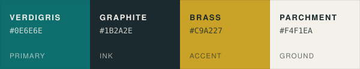

# abCA identity

The name, the mark, the colors and the type — decided once and written down, so
a README badge, a slide and a sticker all come out looking like the same tool.

| | |
| --- | --- |
| **Name** | agent-based Claim Analyzer |
| **Short form** | abCA |
| **Mark** | the mongoose |
| **Color** | verdigris |
| **Seal motto** | Check it yourself. |


## The files

| File | What it settles |
| --- | --- |
| [`tokens.json`](tokens.json) / [`tokens.css`](tokens.css) | Color tokens with measured contrast |
| [`logo/`](logo/) | Every mark, generated from one outline |

`src/` never reads this directory. The Analyzer's prompts do not know the
mascot, the colors or the motto, and a test enforces that. A tool that could
tell whose claims it was checking is a tool that could, eventually, be kind to
one of them — so its own identity is kept out of it exactly as anyone else's is.

## The marks

Every file in `logo/` is generated by `scripts/build_identity.py` from a single
outline. There is exactly one copy of the animal in this repository. Redrawing
it by hand is how a project ends up with nine slightly different mascots.

```bash
python scripts/build_identity.py           # rebuild every mark
python scripts/build_identity.py --check   # fail if any file is stale
```

| File | Use |
| --- | --- |
| `abca-seal.svg` | Formal. Release notes, published verdicts, anything abCA signs |
| `abca-mark.svg` | The head alone. App icons, avatars, stamps |
| `abca-lockup.svg` | Mark + wordmark. Default for web headers and documents |
| `abca-wordmark.svg` | Type only, where the mark would be redundant |
| `favicon.svg` | 16px and up |
| `abca-palette.svg` | Swatch strip for READMEs and anywhere CSS cannot render |

Each comes in three colorways and **only** three: primary (verdigris), mono
(graphite), and reversed (parchment on dark). There is no fourth.

### The mongoose, drawn

A head in profile, facing right, eye knocked out of the same path so the mark is
a single shape that survives recoloring. Four things make it a mongoose rather
than a fox: a **small low rounded ear** set back on the skull, a **long
straight tapering muzzle** with a blunt tip, a **low skull** with no forehead
dome, and an **open alert eye**. It never bares teeth. It watches; it does not
threaten.

Why a mongoose: the animal is known for taking on things that are dangerous to
take on, and for doing it by being quick and careful rather than big. It is
*resistant* to snake venom, not immune — and that distinction is the whole
point of the mark. The tool is resistant to bad claims because it checks them;
it is not immune to being wrong, and nothing in this repository says otherwise.

## Color



**Verdigris** is the color copper turns on its own, over time, by oxidation:
the patina on courthouse roofs and public records buildings. Verification has a
color and it is not a new one.

| Token | Hex | Role |
| --- | --- | --- |
| `verdigris` | `#0E6E6E` | Primary. The abCA color |
| `graphite` | `#1B2A2E` | Text, seal linework, the dark ground |
| `brass` | `#C9A227` | Accent. Stars and rules |
| `parchment` | `#F4F1EA` | The default ground |
| `verdigris-deep` | `#0B5555` | Hover and pressed states |
| `verdigris-pale` | `#149E9E` | Links on the dark ground |
| `graphite-soft` | `#2E474E` | Secondary text |
| `brass-deep` | `#856B1A` | Gold **text** on light — see below |
| `parchment-warm` | `#EEE9DE` | Panels and table stripes |

### Contrast, measured

These numbers are computed from the hex values above by
`scripts/check_contrast.py`, and the build fails if the guide drifts from the
colors. A style guide that asserts its own accessibility without measuring it is
decoration, and this project does not get an exemption from its own standard.

| Pairing | Ratio | Grade |
| --- | --- | --- |
| `graphite` on `parchment` | 13.14:1 | AAA |
| `parchment` on `graphite` | 13.14:1 | AAA |
| `brass` on `graphite` | 6.13:1 | AA |
| `white` on `verdigris` | 6.04:1 | AA |
| `verdigris` on `white` | 6.04:1 | AA |
| `verdigris` on `parchment` | 5.36:1 | AA |
| `parchment` on `verdigris` | 5.36:1 | AA |
| `verdigris-pale` on `graphite` | 4.53:1 | AA |
| `brass-deep` on `parchment` | 4.52:1 | AA |
| **`brass` on `parchment`** | **2.14:1** | **fails** |
| **`brass` on `verdigris`** | **2.5:1** | **fails** |

**Brass is not a text color on a light ground.** It is for stars and rules. For
gold text on light, use `brass-deep`. Both failures are kept in the token file
on purpose, asserted as failures, so nobody rediscovers them on a printed banner.

## Type

System sans, weights 500 and 700 only. `Helvetica Neue, Helvetica, Arial,
DejaVu Sans, sans-serif`.

No display face, no script, no condensed variant. A tool that requires plain
language is not going to set its own name in something that needs a license and
a fallback plan. Ring text on the seal is set at wide tracking; the wordmark is
`abCA` at 700 over the full name at 500 in small caps tracking.

The master SVGs carry **live text**, so anyone can re-set the wordmark. Files
going to a printer should have the text converted to outlines first — that is a
production step, not something the masters bake in.

## Voice

Short sentences. Concrete nouns. The active voice. Roughly an eighth-grade
reading level, checked, because the tool requires it of its own output and
cannot exempt its own documentation.

**Do**

- State the claim, then the source, then the confidence.
- Say "we do not know" in those words.
- Publish the run hash next to the claim.
- Name the pattern; cite the finding that documents it.

**Do not**

- Name an actor the evidence does not support. Ever.
- Use "obviously," "clearly," "everyone knows," or "the truth is."
- Score a person, rate an account, or rank a speaker.
- Round a number toward the more useful answer.
- Say "immune" where the honest word is "resistant."

## Misuse

| Don't | Why |
| --- | --- |
| Recolor the mark outside the three colorways | The colorways *are* the identity; a fourth is a different tool |
| Rotate, skew, mirror, or add a gradient to the mark | It is one path; distortion is how nine variants start |
| Give the mongoose bared teeth or a narrowed eye | Attack animal is a different mark. It watches; it does not threaten |
| Set the seal motto in Latin | The absence of Latin is the argument |
| Use `brass` for body text on light | 2.14:1. It fails, and it is documented as failing |
| Put a factual claim in project material without a run hash | That is a defect, not a design choice |

## Rebuilding and checking

```bash
python scripts/build_identity.py --check   # marks match their generator
python scripts/check_contrast.py           # the guide's contrast claims are true
```

Both run in CI. The identity is verified the same way the Analyzer is, because
a brand guide that cannot pass its own check has already lost the argument.
